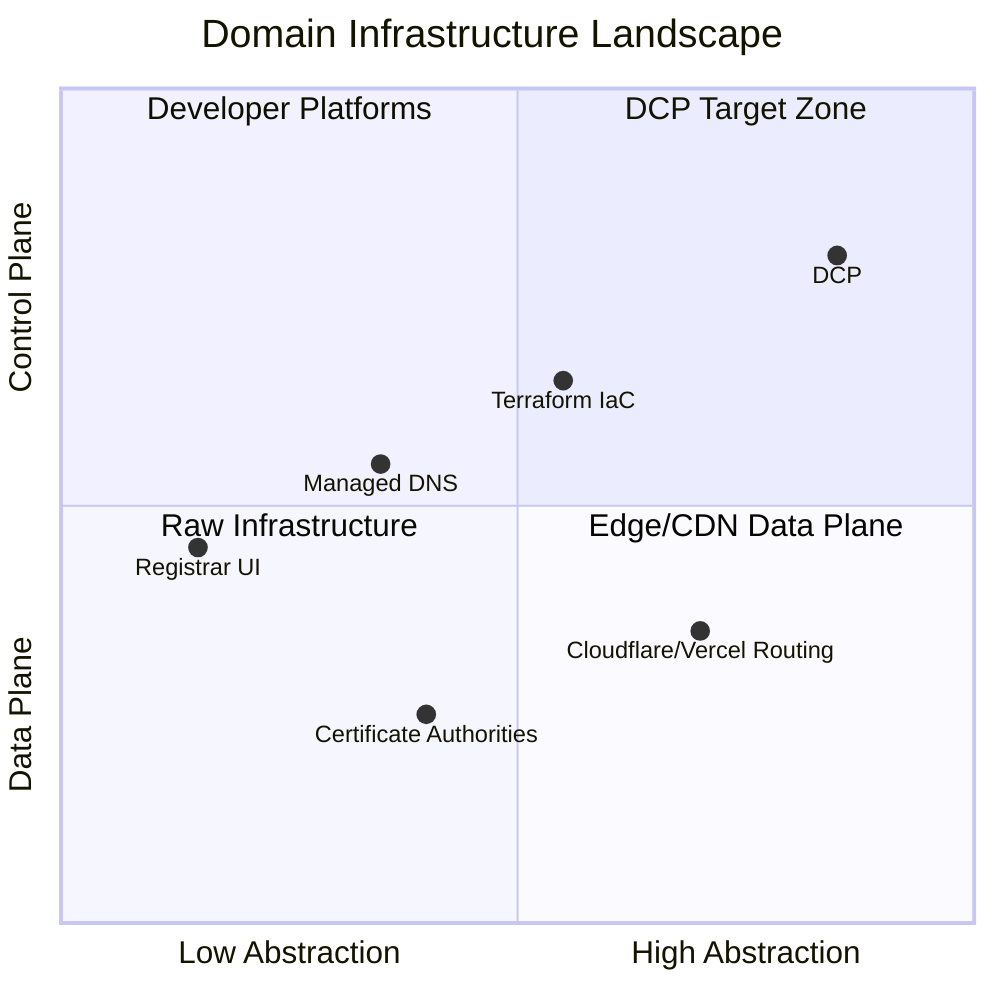

# Category Definition

| Field | Value |
|-------|-------|
| Doc ID | `dcp-vision-02` |
| Category | Vision |
| Status | draft |
| Version | 0.1.0-draft |
| Depends on | dcp-vision-01 |

---

## Summary

**Domain Control Plane** is a new infrastructure category: the programmable control layer above DNS, registrars, TLS, email authentication, and edge routing.

It is not "managed DNS." It is **intent-driven domain operations** with transactional semantics.

---

## Category Boundaries

| In Category | Out of Category |
|-------------|-----------------|
| Intent declaration & compilation | Raw zone file editing as primary UX |
| Transactional apply with rollback | Best-effort PUT with no compensating action |
| Scoped domain OAuth for apps/agents | Shared registrar passwords in CI |
| Route runtime (instant path changes) | DNS-only providers with no routing |
| Provenance & ownership graph | Ad-hoc change logs in ticketing |
| Certificate firewall & takeover immunity | Manual security review per change |
| Simulation & replay before production | "Hope it works in prod" |

---

## Adjacent Categories

### vs Managed DNS (Cloudflare DNS, Route53, NS1)

Managed DNS offers record CRUD. DCP offers **intent** (`serve api.example.com from service X with auto-TLS and DMARC-aligned mail`) and handles cross-provider orchestration, permissions, and rollback.

**Relationship:** DCP uses managed DNS providers as adapters — it does not compete on authoritative resolution at launch.

### vs Infrastructure-as-Code (Terraform, Pulumi)

IaC describes desired state but lacks:

- Transactional leases and phased apply
- Real-time propagation observability
- Instant route runtime decoupled from DNS TTL
- Domain-scoped OAuth for third-party apps
- Built-in takeover and certificate policy

**Relationship:** DCP can export Terraform; Terraform can be a *source* of intent (import), not the execution engine.

### vs Edge Platforms (Vercel, Fly, Netlify custom domains)

These solve routing for *their* platform. DCP is **provider-neutral** and models the full domain surface (email, verification, registrar, multi-origin).

**Relationship:** DCP route runtime can front any origin; edge platforms become recipe targets.

### vs Email APIs (Resend, SendGrid domain setup)

Email APIs solve SPF/DKIM for *their* sending domain. DCP generalizes **provider verification recipes** (Google Workspace, GitHub Pages, Atlassian, etc.).

**Relationship:** DCP is the superset; email is one intent facet.

---

## Category Primitives

Every Domain Control Plane product should expose these primitives:

| Primitive | Description |
|-----------|-------------|
| `Intent` | Versioned desired domain state |
| `Transaction` | Atomic mutation with plan/apply/verify/rollback |
| `Capability` | Scoped permission token |
| `Recipe` | Signed provider adapter |
| `Route` | Instant traffic directive behind stable DNS |
| `Probe` | Observable signal (DNS, TLS, HTTP, email) |
| `Provenance` | Attested change lineage |

Products missing transactional rollback or scoped capabilities are **managed DNS**, not DCP.

---

## Market Wedge

**Wedge:** Multi-tenant SaaS custom domains + safe CI domain automation.

**Expand:** Enterprise domain governance, agent-native domain tools, self-hosted air-gapped control plane.

---

## Category Name Alternatives (Rejected)

| Name | Why rejected |
|------|--------------|
| Domain PaaS | Implies hosting; DCP is control-only |
| DNS 2.0 | Implies DNS replacement |
| Domain Orchestrator | Too generic; misses permissions/versioning |
| Intent DNS | Over-indexes on DNS; ignores TLS/email/routing |

**Selected:** Domain Control Plane — parallels Kubernetes control plane vs data plane distinction engineers already understand.