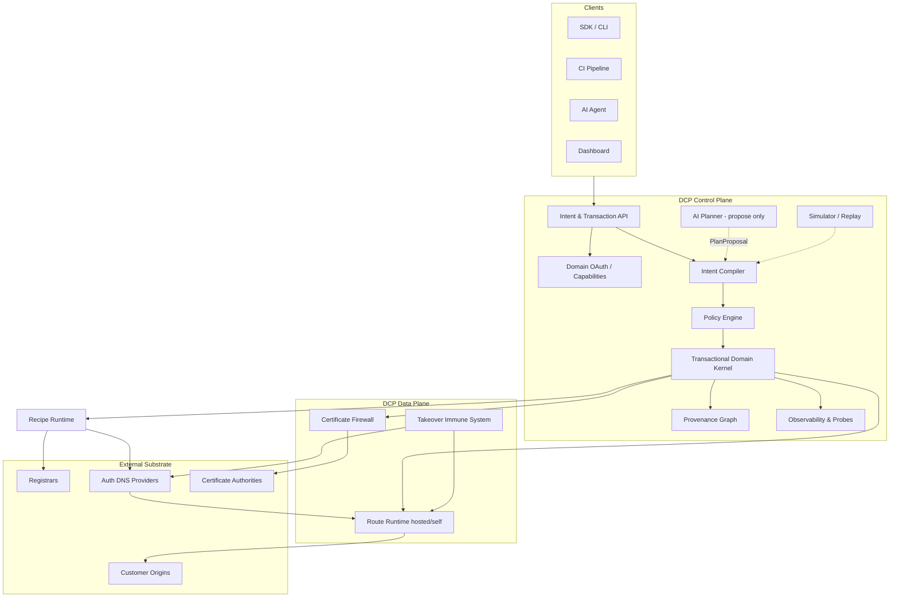
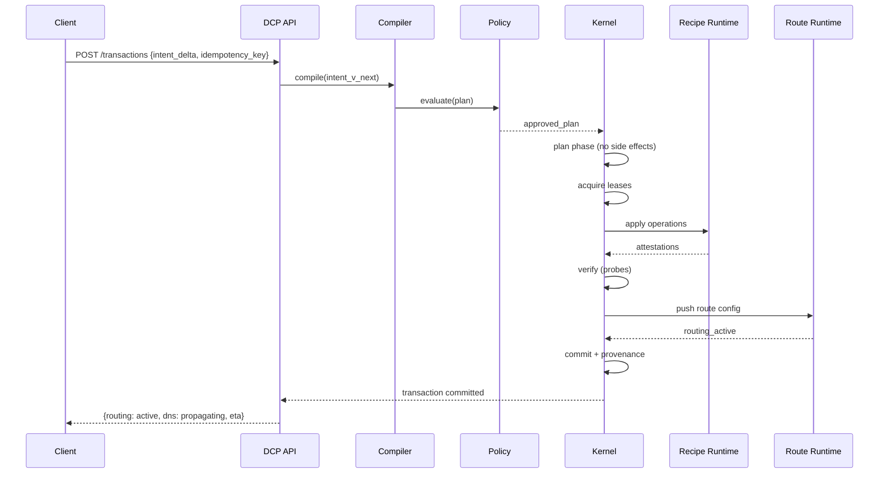

# System Overview

| Field | Value |
|-------|-------|
| Doc ID | `dcp-arch-01` |
| Category | Architecture |
| Status | draft |
| Version | 0.1.0-draft |
| Depends on | dcp-vision-01, dcp-vision-03 |

---

## Summary

DCP is a **control plane** that accepts versioned domain intent, compiles it to provider operations, executes them transactionally, and maintains instant routing via an optional **route runtime**. DNS providers and registrars are downstream adapters.

---

## High-Level Architecture

---

## Component Responsibilities

| Component | Responsibility |
|-----------|----------------|
| Intent & Transaction API | CRUD intent, submit transactions, query status |
| Domain OAuth | Issue scoped capability tokens |
| Intent Compiler | Intent → IR → operation plan |
| Policy Engine | Deny/allow/audit rules on plans |
| Transactional Kernel | Lease, apply, verify, commit, rollback |
| Recipe Runtime | Execute signed provider adapters |
| Provenance Graph | Ownership, lineage, fences |
| Route Runtime | Instant HTTP/TLS routing |
| Certificate Firewall | Gate TLS issuance |
| Takeover Immune System | Detect dangling/reclaimable records |
| Observability | Probes, events, metrics, audit export |
| Simulator / Replay | Dry-run and historical re-execution |
| AI Planner | Natural language → PlanProposal (non-authoritative) |

---

## Request Lifecycle

---

## State Stores

| Store | Contents | Consistency |
|-------|----------|-------------|
| Intent Store | Versioned intent documents | Strong (per domain) |
| Transaction Log | Append-only event sourcing | Strong |
| Provenance Graph | Nodes, edges, fences | Strong |
| Lease Table | Active resource locks | Strong, TTL |
| Route Config Store | Runtime routing versions | Strong + edge sync |
| Probe Results | Time-series propagation data | Eventual |
| Recipe Registry | Signed recipe bundles | Strong + CDN cache |

---

## Deployment Surfaces

See [dcp-04-deployment-modes.md](./dcp-04-deployment-modes.md).

| Mode | Control Plane | Route Runtime |
|------|---------------|---------------|
| Hosted SaaS | DCP cloud | DCP anycast edge |
| Hybrid | DCP cloud | Customer self-hosted runtime |
| Self-hosted | Customer VPC | Customer edge |
| Air-gapped | On-prem appliance | On-prem runtime |

---

## Failure Domains

| Domain | Blast radius | Mitigation |
|--------|--------------|------------|
| Single transaction | One domain resource | Rollback, lease expiry |
| Provider API outage | Affected operations paused | Retry, alternate recipe, degrade routing only |
| Control plane region loss | API unavailable | Multi-region failover; runtime serves last config |
| Runtime edge loss | Regional routing | Anycast failover, health checks |
| Compiler bug | Incorrect plans | Policy sandbox, simulation gate, version pinning |