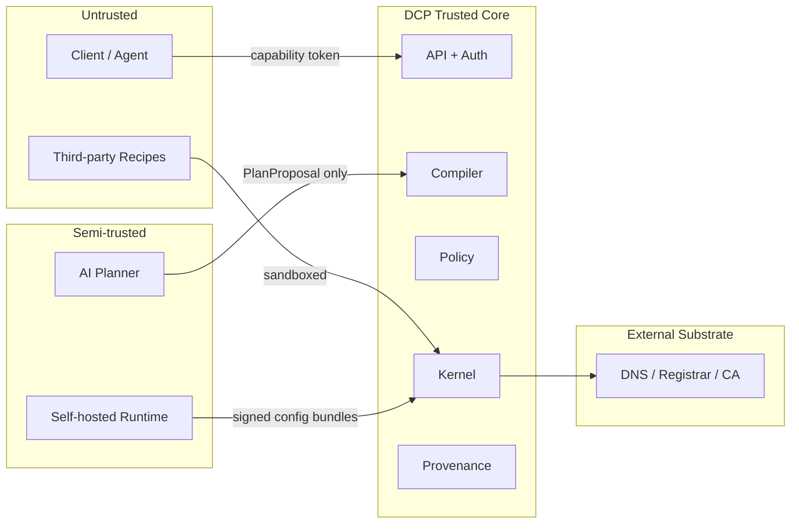

# Layers and Boundaries

| Field | Value |
|-------|-------|
| Doc ID | `dcp-arch-02` |
| Category | Architecture |
| Status | draft |
| Version | 0.1.0-draft |
| Depends on | dcp-arch-01 |

---

## Summary

DCP organizes into five layers with explicit trust boundaries. Data never flows upward across boundaries without attestation.

---

## Layer Model

```
┌─────────────────────────────────────────────────────────────┐
│ L5: Client Layer          SDK, CLI, Terraform provider    │
├─────────────────────────────────────────────────────────────┤
│ L4: API & Auth Layer      REST/gRPC, Domain OAuth, quotas │
├─────────────────────────────────────────────────────────────┤
│ L3: Logic Layer           Compiler, Policy, AI Planner, Sim│
├─────────────────────────────────────────────────────────────┤
│ L2: Execution Layer       Kernel, Recipe RT, Provenance   │
├─────────────────────────────────────────────────────────────┤
│ L1: Data Plane Layer      Route Runtime, Cert FW, Immune  │
├─────────────────────────────────────────────────────────────┤
│ L0: Substrate             Registrars, DNS, CAs, Origins    │
└─────────────────────────────────────────────────────────────┘
```

---

## Trust Boundaries



| Boundary | What crosses it | Verification |
|----------|-----------------|--------------|
| Client → API | Intent, transaction requests | Capability token + idempotency |
| AI → Compiler | PlanProposal JSON | Schema validation; no direct apply |
| Compiler → Kernel | Operation plan | Policy approval + deterministic hash |
| Kernel → Recipe RT | Recipe invocations | Signature + capability injection |
| Kernel → Runtime | Config bundle | Signed manifest, version monotonicity |
| Runtime → Origin | HTTP/TLS | mTLS optional, origin allowlist |

---

## Layer Contracts

### L4 → L3: Compile Request

```json
{
  "intent_version": "int_v12",
  "intent_delta": { },
  "compile_options": {
    "target_providers": ["cloudflare:zone_abc"],
    "simulation": false
  }
}
```

### L3 → L2: Approved Plan

```json
{
  "plan_id": "plan_8f3a",
  "plan_hash": "sha256:...",
  "operations": [],
  "compensations": [],
  "policy_decision_id": "pol_991"
}
```

### L2 → L1: Runtime Push

```json
{
  "bundle_id": "rtb_44c",
  "domain": "api.example.com",
  "routes": [],
  "tls": {},
  "signature": "sig_dcp_..."
}
```

---

## Multi-Tenancy Boundaries

| Isolation unit | Enforcement |
|----------------|-------------|
| Organization | API namespace, billing, policy packs |
| Domain | Leases, provenance root, capability prefix |
| Environment | `production` / `staging` intent branches |
| Subdomain | Capability scope `*.staging.example.com` |

Hard rule: **no cross-domain lease** without explicit federation policy.

---

## Escape Hatches

| Hatch | Layer | Policy |
|-------|-------|--------|
| Raw DNS records | L3 compiler input | `policy.raw_dns:allow` + MFA |
| Direct provider console | L0 | Detected as drift by immune system |
| Emergency rollback | L2 kernel | Break-glass capability, 24h expiry |

---

## Observability Boundaries

| Signal | Emitted at | Consumed by |
|--------|------------|-------------|
| `transaction.phase_changed` | L2 | L4 API, webhooks |
| `probe.result` | L1/L2 | L4 dashboards |
| `compiler.plan_rejected` | L3 | L4, AI feedback loop |
| `runtime.request_routed` | L1 | L4 metrics (sampled) |