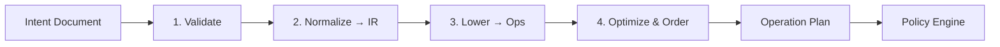

# Compilation Pipeline

| Field | Value |
|-------|-------|
| Doc ID | `dcp-arch-03` |
| Category | Architecture |
| Status | draft |
| Version | 0.1.0-draft |
| Depends on | dcp-arch-01, dcp-core-02 |

---

## Summary

The compilation pipeline transforms **Domain Intent** into an **Operation Plan** through four deterministic passes. No pass may perform provider side effects.

---

## Pipeline Stages



---

## Pass 1: Validate

| Check | Example failure |
|-------|-----------------|
| Schema conformance | Missing `route.origin` |
| Ownership fence | Subdomain owned by another tenant |
| Capability scope | Token lacks `tls:issue` |
| Conflicts | Two apex routes declared |
| Provider capability | Route53 zone not linked |

Output: `ValidatedIntent` or `CompileError[]`

---

## Pass 2: Normalize → Intent IR

Intent IR is provider-neutral:

```yaml
# Intent IR fragment (illustrative)
fqdn: api.example.com
bindings:
  - kind: http_route
    origin: https://origin.internal:443
    paths: ["/*"]
    tls:
      mode: auto
      min_version: "1.2"
  - kind: email_auth
    spf:
      include: ["_spf.google.com"]
    dkim:
      selectors:
        - name: dcp2026
          public_key_ref: secret:dkim_pub
  - kind: provider_verification
    provider: github_pages
    token_ref: secret:gh_verify
```

Normalization rules:

- Expand aliases (`@` → apex FQDN)
- Resolve wildcard specificity
- Merge duplicate bindings by precedence
- Attach environment overlay (`staging` branch)

---

## Pass 3: Lower → Provider Operations

Lowering uses **recipe selection**:

```
IR binding (http_route) + provider(cloudflare)
  → recipe: cloudflare@v2/http_route
  → ops: [UPSERT CNAME, UPSERT Worker route, ...]
```

Each operation struct:

```json
{
  "op_id": "op_17",
  "provider": "cloudflare",
  "resource": "zone:abc123",
  "action": "dns.upsert",
  "params": { "type": "CNAME", "name": "api", "content": "proxy.dcp.dev" },
  "depends_on": [],
  "timeout_ms": 30000,
  "compensation": {
    "action": "dns.restore",
    "snapshot_ref": "snap_op_16"
  }
}
```

---

## Pass 4: Optimize & Order

| Optimization | Purpose |
|--------------|---------|
| Topological sort | Respect `depends_on` |
| Batch merge | Coalesce DNS changes per zone |
| Minimize churn | Skip no-op diffs |
| Parallelize | Independent provider calls |
| Compensation pairing | Every mutating op gets rollback op |

Output includes `plan_hash` for reproducibility.

---

## Determinism Guarantee

Given:

- `intent_version` (content-addressed)
- `compiler_version` (semver)
- `recipe_set_version` (signed bundle hash)
- `provider_snapshot` (read-only state at plan time)

Then: `plan_hash` is **stable and reproducible**.

AI proposals must compile through this pipeline — never inject operations post-policy.

---

## Error Taxonomy

| Code | Phase | Retryable |
|------|-------|-----------|
| `COMPILE_SCHEMA` | Validate | No |
| `COMPILE_CONFLICT` | Validate | No |
| `COMPILE_UNSUPPORTED` | Lower | No |
| `COMPILE_PROVIDER_DRIFT` | Lower | Yes (refresh snapshot) |
| `COMPILE_RECIPE_MISSING` | Lower | No |

---

## Integration Points

| Consumer | Usage |
|----------|-------|
| Kernel plan phase | Executes compiled plan |
| Simulator | Compiles with synthetic provider snapshot |
| AI Planner | Compiles `PlanProposal` for feedback |
| CI | `dcp compile --dry-run` gates merge |