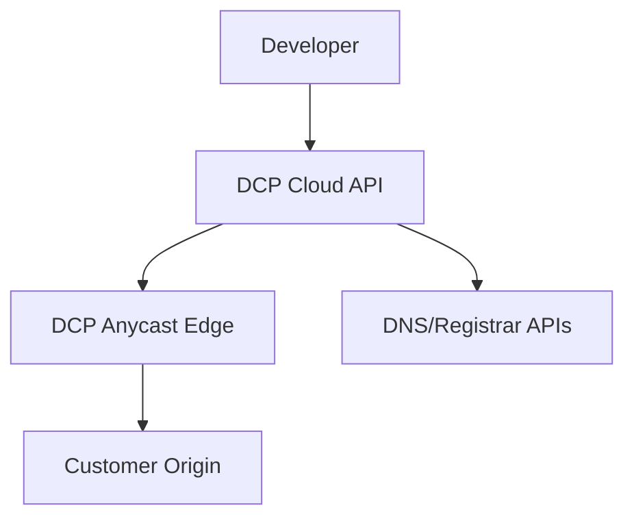

# Deployment Modes

| Field | Value |
|-------|-------|
| Doc ID | `dcp-arch-04` |
| Category | Architecture |
| Status | draft |
| Version | 0.1.0-draft |
| Depends on | dcp-arch-01 |

---

## Summary

DCP supports four deployment modes along two axes: **control plane location** and **route runtime location**. All modes share the same APIs and schemas.

---

## Mode Matrix

| Mode | Control Plane | Route Runtime | Target Customer |
|------|---------------|---------------|-----------------|
| **Hosted** | DCP SaaS | DCP anycast edge | Startups, SaaS, indie devs |
| **Hybrid** | DCP SaaS | Customer-managed | Regulated data plane, global latency |
| **Self-hosted** | Customer VPC/K8s | Customer edge | Enterprise, data residency |
| **Air-gapped** | On-prem appliance | On-prem runtime | Gov/defense, offline |

---

## Hosted (Default)



**Characteristics:**

- Fastest time-to-value (< 60s first route)
- DCP operates probes, immune system, cert firewall
- Stable DNS targets: `*.proxy.dcp.dev` or dedicated anycast IP
- Multi-tenant isolation via org + domain fences

**Tradeoffs:** Data plane traffic through DCP edge (optional bypass to direct origin).

---

## Hybrid

Control plane in DCP cloud; route runtime self-hosted.

```
┌──────────────┐         signed bundles        ┌─────────────────┐
│  DCP Cloud   │ ────────────────────────────► │ Customer Runtime│
│  Kernel/API  │ ◄──────── attestations ────── │ (K8s / VM / CF) │
└──────────────┘                               └─────────────────┘
```

**Use cases:**

- PCI/HIPAA: traffic must not traverse vendor edge
- Existing CDN investment (Akamai, Fastly) as runtime target
- Ultra-low latency custom POPs

**Requirements:**

- Runtime registers with mTLS
- Config bundles signed by DCP; runtime verifies offline
- Heartbeat + version reporting mandatory

---

## Self-Hosted

Full control plane in customer infrastructure.

| Component | Deployment |
|-----------|------------|
| API + Kernel | K8s operators or Helm chart |
| Intent Store | Postgres + S3-compatible blob |
| Transaction Log | Kafka / NATS / Postgres logical replication |
| Recipe Runtime | Sandboxed WASM workers |
| Provenance | Graph DB (Neo4j) or adjacency in Postgres |

**Licensing model (conceptual):** Enterprise license + support; recipes still signed by DCP or customer CA.

**Federation:** Optional phone-home for recipe updates and threat intel (takeover signatures).

---

## Air-Gapped

Self-hosted plus:

- No outbound internet from control plane
- Recipe bundles delivered via sneakernet / internal artifact registry
- Probe network internal only
- Manual CA integration for TLS

Immune system uses **internal resolver simulation** only; external takeover risk reduced but not eliminated.

---

## Component Placement by Mode

| Component | Hosted | Hybrid | Self-hosted | Air-gapped |
|-----------|--------|--------|-------------|------------|
| Intent API | Cloud | Cloud | Local | Local |
| Kernel | Cloud | Cloud | Local | Local |
| Route Runtime | Cloud | Local | Local | Local |
| Certificate Firewall | Cloud | Cloud | Local | Local |
| Probe Network | Global | Global + local | Customer | Internal |
| AI Planner | Cloud (opt-out) | Cloud (opt-out) | Local or disabled | Disabled |

---

## DNS Delegation Patterns

| Pattern | Hosted setup | DNS churn |
|---------|--------------|-----------|
| **Proxy CNAME** | `api → api-tenant.proxy.dcp.dev` | Once |
| **ANAME/APEX** | Apex ALIAS to proxy pool | Once |
| **NS delegation** | Subzone NS to DCP DNS adapter | Once per zone |
| **Full zone** | Transfer or secondary DNS | Low after initial |

---

## High Availability

| Tier | RPO | RTO | Architecture |
|------|-----|-----|--------------|
| Hosted Standard | 0 (intent) | 5 min | Multi-AZ, active-passive kernel |
| Hosted Enterprise | 0 | 1 min | Multi-region active-active API |
| Self-hosted | Customer-defined | Customer-defined | HA K8s + DB replication |

**Critical:** Route runtime must serve **last known good config** if control plane unavailable.

---

## Upgrade & Version Skew

| Artifact | Skew policy |
|----------|-------------|
| API | N-1 clients supported |
| Compiler | Pinned per org; auto-upgrade opt-in |
| Runtime bundle | Forward-compatible 2 versions |
| Recipes | Semver; kernel rejects major mismatch |