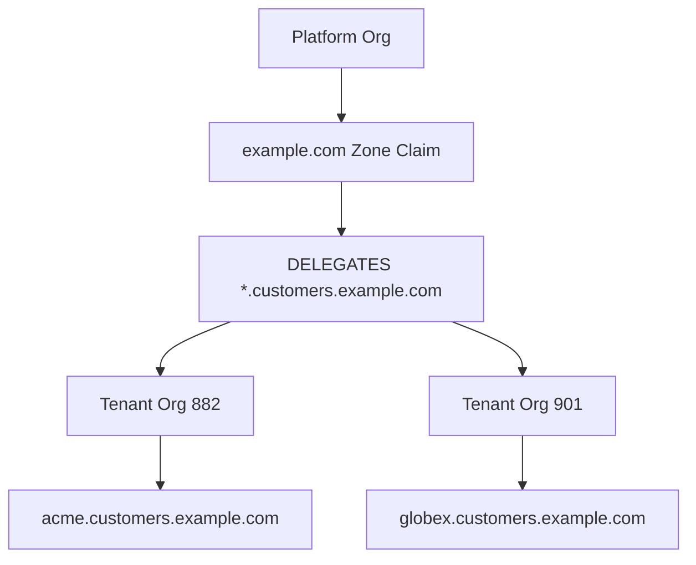

# Multi-Tenant SaaS Model

| Field | Value |
|-------|-------|
| Doc ID | `dcp-arch-05` |
| Category | Architecture |
| Status | draft |
| Version | 0.1.0-draft |
| Depends on | dcp-core-06, dcp-core-04, dcp-arch-04 |

---

## Summary

The primary MVP wedge is **B2B SaaS custom domains**: one platform org delegates subdomains to tenant orgs with provenance fences, scoped capabilities, and instant routing — without per-tenant registrar access.

---

## Actor Model



| Actor | Owns | Can delegate |
|-------|------|--------------|
| Platform org | Apex zone, wildcard pattern | Subdomain prefixes to tenants |
| Tenant org | Specific FQDN claims | Routes/origins only (not zone) |
| End customer | Brand domain (optional) | CNAME to platform |

---

## Onboarding Flows

### Flow A: Subdomain on Platform Zone (most common)

Customer wants `acme.customers.example.com`.

1. Platform pre-delegates `*.customers.example.com` to tenant pool
2. Tenant claims `acme` slug via platform API
3. DCP compiles: route entry only (DNS wildcard already stable)
4. **Routing active < 10s** — zero DNS ops

### Flow B: Customer Apex/Subdomain (bring your own domain)

Customer wants `app.acme.com`.

1. Customer adds CNAME `app.acme.com → acme.edge.dcp.dev` (one DNS change)
2. Platform tenant submits intent for `app.acme.com`
3. DCP verifies TXT claim on `_dcp-challenge.app.acme.com`
4. Routing active after claim; DNS propagates independently

### Flow C: Full Customer Zone

Enterprise customer delegates NS or uses DCP DNS adapter subzone.

Higher friction; full immune system visibility.

---

## Delegation Schema

```json
{
  "delegation_id": "del_442",
  "from_org": "org_platform",
  "to_org": "org_tenant_882",
  "resource": "fqdn:*.customers.example.com",
  "constraints": {
    "max_fqdns": 5,
    "allowed_facets": ["route", "tls"],
    "forbidden_facets": ["registrar", "raw_dns"],
    "environment": "production"
  },
  "expires_at": null
}
```

---

## Fence Enforcement

Compiler checks before every tenant transaction:

```
∀ op ∈ plan:
  op.resource ⊆ tenant.claimed_fqdns
  op.facet ∈ delegation.constraints.allowed_facets
```

Violation → `COMPILE_CONFLICT` + `FENCE_VIOLATION`.

---

## Capability Tokens per Tenant

Platform issues tenant-scoped CI token:

```json
{
  "capabilities": [
    {
      "action": "route:write",
      "resource": "fqdn:acme.customers.example.com"
    },
    {
      "action": "txn:submit",
      "resource": "environment:production",
      "constraints": { "max_origins": 3 }
    }
  ],
  "deny": [
    { "action": "*", "resource": "fqdn:*.customers.example.com", "except": "fqdn:acme.customers.example.com" }
  ]
}
```

---

## Intent Layout

Platform maintains **base intent**; tenants submit **overlays**:

```yaml
# Platform base (org_platform)
spec:
  routes:
    - host: "*.customers.example.com"
      traffic:
        origin: https://platform-router.internal
      tls:
        mode: auto
  policy:
    takeover: strict

---
# Tenant overlay (org_tenant_882) — merged at compile
spec:
  routes:
    - host: acme.customers.example.com
      traffic:
        origin: https://tenant-882.k8s.internal
```

Merge rules: longest FQDN match wins for route origins.

---

## Billing & Metering Hooks

| Meter | Unit |
|-------|------|
| Active FQDN routes | Per FQDN/month |
| Transactions | Per commit |
| Probes | Per probe-run |
| Delegated tenants | Per tenant org |

Platform org is billing root; tenants may be sub-billed via metadata labels.

---

## Support & Debugging

Platform support dashboard (read-only):

```
GET /v1/provenance/claims?fqdn=acme.customers.example.com
GET /v1/transactions?domain=customers.example.com&actor=org_tenant_882
```

Tenant sees only their FQDN scope. Platform sees aggregate immune system risks.

---

## Failure Scenarios

| Scenario | Behavior |
|----------|----------|
| Tenant deleted | Quarantine FQDN; optional auto-remove route |
| Tenant origin compromised | Platform policy can force rollback |
| Tenant exceeds FQDN quota | Transaction rejected at policy |
| Wildcard cert compromise | Platform rotates wildcard; tenants unaffected at route layer |

---

## Reference Example

See [dcp-01-multi-tenant-saas-intent.md](../08-examples/dcp-01-multi-tenant-saas-intent.md).