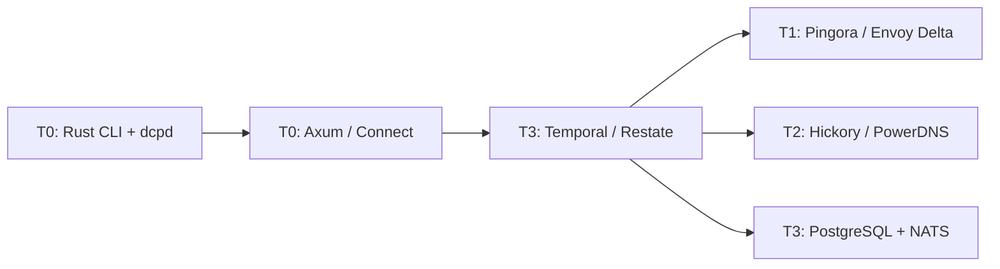
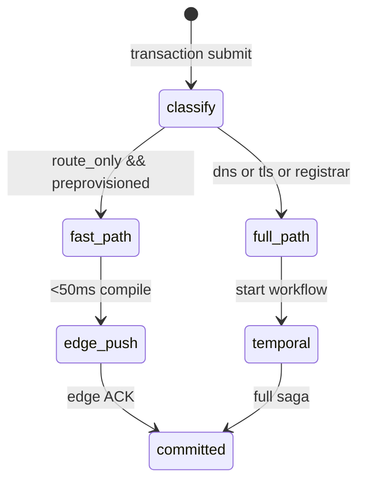

# Technology Stack

| Field | Value |
|-------|-------|
| Doc ID | `dcp-arch-08` |
| Category | Architecture |
| Status | draft |
| Version | 0.1.0-draft |
| Depends on | dcp-arch-01, dcp-arch-04, dcp-arch-07 |

---

## Summary

Framework and infrastructure choices for Domain Control Plane (DCP), researched against speed goals ([dcp-07-extreme-speed-optimizations](./dcp-07-extreme-speed-optimizations.md)), transactional kernel requirements ([dcp-core-01](../03-core-systems/dcp-01-transactional-domain-kernel.md)), and deployment modes ([dcp-arch-04](./dcp-04-deployment-modes.md)).

**Default recommendation:** Stack **A (Speed-first)** for hosted GA; borrow **B (Balanced)** for MVP weeks 1–14; ship **C (Enterprise)** as Helm appliance in Phase 3.

---

## Decision Framework

Choose frameworks by **latency tier**, not popularity:

| Tier | User-visible SLO | Framework constraint |
|------|------------------|----------------------|
| **T0 Interactive** | <100ms | In-process or unix socket; no workflow engine in path |
| **T1 Routing** | <500ms | Push config to edge; Delta xDS or equivalent |
| **T2 Authoritative** | <200ms | In-memory zone + anycast; avoid remote DNS APIs |
| **T3 Workflow** | <2s commit | Durable execution for saga phases |
| **T4 Propagation** | <60s p95 | NOTIFY + owned resolver + probes (not a framework) |



---

## Stack A: Speed-First (Hosted GA)

**Profile:** Maximum performance, full vertical integration, Rust-heavy.

| Layer | Primary | Version pin strategy |
|-------|---------|----------------------|
| CLI + daemon | **Rust** — `clap`, `tokio`, `ratatui` | Ship with API major |
| Public API | **Axum** + **Tower** + **tonic** (internal) | Semver per service |
| API schema | **Buf** + **protobuf**; REST via OpenAPI export | `buf.lock` in repo |
| External RPC | **Connect-RPC** (optional REST/gRPC bridge) | [CNCF sandbox](https://connectrpc.com/) |
| Transaction kernel | **Temporal** (Rust/Go workers) | Pin server + SDK |
| Fast-path kernel | In-process **Tokio FSM** for route-only | No Temporal round-trip |
| Leases / cache | **Dragonfly** or **Redis** | TTL enforced in kernel |
| Intent + audit | **PostgreSQL 16+** (JSONB, RLS) | Managed RDS/Aurora |
| Event bus | **NATS JetStream** | CloudEvents envelope |
| Compiler | **Rust** — `serde`, `schemars`, `jsonschema` | `compiler_version` in plans |
| Policy | **Cedar** (embedded) | Policy packs versioned |
| Recipe runtime | **wasmtime** + **Wizer** + **wasm-opt** | Recipe semver |
| Route edge | **Pingora** (Cloudflare OSS) | Custom Delta config layer |
| Edge config push | **tonic** gRPC Delta bundles (xDS-inspired) | Per-FQDN version pointer |
| Auth DNS | **Hickory DNS** (fork: in-memory zones) | Same release train as edge |
| Resolver | **Hickory** public resolver | NOTIFY-triggered prefetch |
| TLS / ACME | **rustls** + **instant-acme** | Cert in Vault |
| Secrets | **OpenBao** / **Vault** | Dynamic provider creds |
| Observability | **OpenTelemetry** → **VictoriaMetrics** + **ClickHouse** | Probe TS in CH |
| IaC (your infra) | **Pulumi** (Rust/Go) | Not customer-facing |

### Why Stack A wins on speed

- **Pingora:** Built by Cloudflare for reverse proxy workloads; same design lineage as their production edge.
- **Hickory:** Rust DNS — co-locate with Pingora in one process or sidecar; sub-millisecond internal NOTIFY.
- **wasmtime + Wizer:** [Arcjet production data](https://blog.arcjet.com/lessons-from-running-webassembly-in-production-with-go-wazero/) — pre-init eliminates cold-start; AOT compile for hot recipes.
- **Route-only fast path:** Bypass Temporal for hot path (see §Kernel dual-path).

---

## Stack B: Balanced Velocity (MVP)

**Profile:** Go-native team, ship in 6 months, still serious speed.

| Layer | Primary |
|-------|---------|
| CLI | **Go** — `cobra`, optional `bubbletea` |
| API | **Connect-RPC** (Go) + **buf** |
| Kernel | **Temporal** Go SDK |
| Compiler | **Go**; recipes in **wazero** sidecar |
| Policy | **OPA** (Rego) → migrate to Cedar |
| Edge | **Envoy** + **go-control-plane** (Delta xDS) |
| Auth DNS | **CoreDNS** (custom `dcp` plugin) |
| Resolver | **CoreDNS** forward + NOTIFY plugin |
| Operator | **Kubebuilder** / **controller-runtime** |
| DB | PostgreSQL + Redis |
| Events | **NATS** or **Redpanda** |

### Why Stack B for MVP

- **Envoy Delta xDS:** Default in [Istio 1.22+](https://jimmysong.io/blog/istio-delta-xds-for-envoy/); proven sub-second config at scale.
- **CoreDNS:** Plugin model ships fastest; [PowerDNS HTTP API](https://doc.powerdns.com/authoritative/http-api/) alternative if team prefers SQL-backed zones (see §DNS deep dive).
- **Connect:** Single proto → Go + TypeScript SDKs; gRPC + JSON over HTTP ([Connect docs](https://connectrpc.com/)).

---

## Stack C: Enterprise Appliance

**Profile:** Customer VPC, Helm install, Gateway API standard.

| Layer | Primary |
|-------|---------|
| Packaging | **Helm** + **OCI** artifacts |
| API + kernel | **Temporal** on K8s |
| SQL | **CockroachDB** or **YugabyteDB** |
| Customer edge | **Envoy Gateway** + **Gateway API** ([K8s 2026 direction](https://kubernetes.io/blog/2026/04/21/gateway-api-v1-5/)) |
| Customer DNS | **CoreDNS** operator |
| Policy | **OPA Gatekeeper** + in-app Cedar |
| Secrets | **External Secrets Operator** + Vault |

---

## Layer Deep Dives

### 1. Transactional kernel (saga engine)

Your phases (`plan → lease → apply → verify → commit | rollback`) need **durable timers**, **idempotency**, **signals** (human approve), and **compensation**.

| Engine | Latency | Ops burden | Best fit |
|--------|---------|------------|----------|
| **Temporal** | ~10–50ms workflow start | PostgreSQL + ES optional; Temporal Cloud reduces ops | **GA default** — battle-tested sagas, signals, queries |
| **Restate** | Lower single-binary latency | Single Rust binary + object store ([architecture](https://restate.dev/blog/building-a-modern-durable-execution-engine-from-first-principles)) | Strong alternative; virtual objects map to `per-domain` state |
| **DBOS** | Postgres-native | No extra server — workflows in PostgreSQL ([DBOS](https://www.dbos.dev/blog/postgres-is-all-you-need-for-durable-execution)) | Attractive if minimizing infra; younger ecosystem |
| **Postgres FSM** | Fastest | You own all edge cases | **Prototype only** (weeks 1–8) |

#### Comparison matrix (2026 research)

| Feature | Temporal | Restate | DBOS |
|---------|----------|---------|------|
| Saga / compensation | ✅ native | ✅ `ctx.run` journal | ✅ transactions |
| Durable timers | ✅ `sleep` | ✅ `ctx.sleep` | ✅ |
| Human approval | ✅ signals | Custom / promises | Custom |
| Idempotency | ✅ workflow ID | ✅ partition hash | ✅ |
| License | MIT | BSL | MIT |
| Self-hosted complexity | High | Medium | Low (Postgres only) |
| Multi-language workers | Go, Java, TS, Py, Rust | TS, Java, Go, Py, Rust | Python, TS, Go |

**Recommendation:**

- **MVP:** Temporal + Go workers (hiring, examples, Cloud option).
- **Evaluate Restate** for per-domain partition model (hash `domain` → partition aligns with DCP leases).
- **Route-only fast path:** Do **not** use any workflow engine — see below.

#### Kernel dual-path (critical for speed)



| Path | Trigger | Engine | Target latency |
|------|---------|--------|----------------|
| **Fast** | `dns_ops == 0` | Tokio task + edge gRPC | p99 <500ms |
| **Full** | Any DNS/registrar/TLS | Temporal workflow | p99 <5s to routing active |

---

### 2. Route edge / proxy

| Framework | Config apply | HTTP/3 | Control plane | Maturity | DCP fit |
|-----------|--------------|--------|---------------|----------|---------|
| **Pingora** (Rust) | Custom Delta | ✅ | Build your own | OSS, CF-backed | **A: best speed ceiling** |
| **Envoy + go-control-plane** | Delta xDS native | ✅ | Mature | Production everywhere | **B: MVP default** |
| **Envoy Gateway** | Gateway API | ✅ | K8s-native | [CNCF enterprise momentum](https://www.cncf.io/blog/2025/06/11/a-year-of-envoy-gateway-ga-building-growing-and-innovating-together/) | **C: self-hosted** |
| **Caddy** | Config reload | ✅ | Simpler | Great for small | Dev/single-tenant only |
| **OpenResty/Lua** | Reload | Via modules | Flexible | Ops-heavy | Avoid for global edge |
| **NGINX Plus** | API | ✅ | Commercial | Stable | Cost + lock-in |

**Config distribution pattern (all stacks):**

1. Immutable `RouteConfigBundle` ([dcp-schema-06](../05-schemas/dcp-06-route-bundle-schema.md))
2. Monotonic `bundle_version` per FQDN
3. Delta push: routes + tls + origins diff only
4. Commit when **quorum ACK** (3/5 nearest POPs)
5. Origin hostnames resolved at push time → literal IPs in bundle

**Data plane micro-optimizations (Pingora/Envoy):**

- `io_uring` / `SO_REUSEPORT`
- Connection pool to origins (no per-request DNS)
- TCP_FASTOPEN where safe
- kTLS to origin (optional)

---

### 3. Authoritative DNS

| Server | Language | Write path | API | Anycast story | DCP fit |
|--------|----------|------------|-----|---------------|---------|
| **Hickory DNS** | Rust | Build in-memory layer | gRPC (custom) | You build | **A: unified Rust stack** |
| **CoreDNS** | Go | Plugin | Plugin hook | Via deployment | **B: fastest plugin MVP** |
| **PowerDNS Authoritative** | C++ | HTTP API + SQL/LMDB | [REST API](https://doc.powerdns.com/authoritative/http-api/) | [Anycast HA guides](https://quantum5.ca/2025/08/04/building-highly-available-services-global-anycast-powerdns-cluster/) | **B+: SQL zones + NOTIFY** |
| **NSD** | C | Zone files | Limited | Anycast | Too static |
| **Knot DNS** | C | Fast serving | Moderate | Good | Secondary option |

#### PowerDNS performance notes (research)

From [PowerDNS performance docs](https://doc.powerdns.com/authoritative/performance.html):

- **LMDB backend** or **bind** fastest for serving; PostgreSQL for large multi-tenant.
- **`receiver-threads`** = CPU cores with `reuseport`.
- **`pdns_control purge`** after intent commit — invalidate packet cache instantly.
- **Packet cache** + **query cache** — tune `cache-ttl`; purge on DCP commit for instant authoritative correctness.

**Hybrid DNS strategy (recommended):**

| Phase | Choice |
|-------|--------|
| MVP | CoreDNS plugin OR PowerDNS HTTP API |
| Speed GA | Hickory in-memory + NOTIFY to resolver fleet |
| Enterprise | PowerDNS + Galera if customers want SQL audit of zones |

---

### 4. Public resolver (propagation accelerator)

| Option | Role |
|--------|------|
| **Hickory resolver** (Rust) | Match Stack A; custom NOTIFY listener |
| **PowerDNS Recursor** | Mature; [performance tuning docs](https://doc.powerdns.com/recursor/performance.html) |
| **CoreDNS forward plugin** | Same binary as auth in Stack B |

**Custom behavior:** On NOTIFY from auth cluster → prefetch changed names → serve with correct TTL → feed probe mesh.

---

### 5. WASM recipe runtime

| Runtime | Host language | AOT compile | Production evidence | DCP fit |
|---------|---------------|-------------|---------------------|---------|
| **wasmtime** | Rust (primary) | ✅ | Bytecode Alliance, security focus ([docs](https://docs.wasmtime.dev/security.html)) | **A: primary** |
| **wazero** | Go | ✅ | [Arcjet production](https://blog.arcjet.com/lessons-from-running-webassembly-in-production-with-go-wazero/) | **B: Go orchestrator** |
| **Wasmer** | Multi | ✅ | Less infra focus | Skip |
| **V8 isolates** | TS | JIT | Cloudflare Workers model | Different trust model |

#### Recipe build pipeline (from Arcjet lessons)

```
Rust/TS recipe source
  → wasm32-wasi build
  → Wizer pre-init snapshot
  → wasm-opt -Oz (SDK) / -O3 (server)
  → cosign sign
  → embed via include_bytes! / go:embed
```

| Optimization | Purpose |
|--------------|---------|
| **Wizer** | Eliminate runtime init; critical for serverless agents |
| **wasm-opt** | 10–27% size/speed gains |
| **AOT compile** (wasmtime) | Amortize compile at deploy, not per request |
| **Pool `Store` instances** | Reuse WASM instances across recipe calls |

**Sandbox:** WASI + network allowlist per recipe ([dcp-core-05](../03-core-systems/dcp-05-signed-provider-recipe-runtime.md)); cap 64MB / 5s wall.

---

### 6. Policy engine

| Engine | Model | Speed | Audit | DCP fit |
|--------|-------|-------|-------|---------|
| **Cedar** | Allow/deny policies | Fast embedded | AWS-proven | **Default** — cert firewall, capability checks |
| **OPA (Rego)** | General logic | Heavier | CNCF standard | Enterprise pack; migrate hot path to Cedar |
| **CEL** | Expressions | Very fast | Limited | Compile-time constraints only |
| **WASM policy plugins** | Custom | Fast | You maintain | Long-tail enterprise rules |

**Split:**

- **Hot path (every compile):** Cedar embedded in Rust/Go compiler
- **Cold path (enterprise):** OPA bundles for org policy packs

---

### 7. API layer + SDKs

| Approach | Pros | Cons |
|----------|------|------|
| **Buf + Connect + protobuf** | One schema → 6 languages; JSON + gRPC | Proto learning curve |
| **Axum + OpenAPI (utoipa)** | Rust-native, fast | SDK gen secondary |
| **Hybrid** | Connect for SDKs; Axum for SSE/webhooks | Two servers or mux |

**Recommended monorepo layout:**

```
proto/
  dcp/v1/
    intent.proto
    transaction.proto
    route.proto
    event.proto
buf.yaml
buf.gen.yaml   → go, ts, rust connect clients
```

[Connect](https://connectrpc.com/) joined CNCF (2025); supports curl, gRPC, gRPC-Web — good for developer ergonomics.

---

### 8. Data stores

| Store | Use | Why |
|-------|-----|-----|
| **PostgreSQL** | Intent versions, transactions, provenance adjacency | JSONB diffs, RLS per org, mature |
| **Dragonfly** / **Redis** | Leases, idempotency keys, plan cache | Sub-ms; TTL native |
| **ClickHouse** | Probe time-series, propagation % | Billions of rows cheap |
| **S3-compatible** | Route bundle archive, recipe blobs | Immutable artifacts |
| **NATS JetStream** | Events, webhook delivery, audit stream | Low latency; replay |

**Avoid as primary:** MongoDB (diff/versioning awkward), Kafka alone (higher latency than NATS for control plane).

**Scale path:** Citus for PostgreSQL sharding by `org_id`; keep per-domain leader on hash.

---

### 9. Real-time + webhooks

| Component | Framework |
|-----------|-----------|
| Event emission | NATS JetStream (partition key = `domain`) |
| SSE to CLI/dashboard | Axum `sse` / Connect streaming |
| Webhook worker | Rust/Go consumer; HMAC signing |
| Retry | JetStream ack + backoff ([dcp-arch-06](./dcp-06-event-and-webhook-model.md)) |

**Avoid:** Phoenix/Elixir split-brain unless team already expert — don't add BEAM for SSE alone.

---

### 10. CLI (`dcp` binary)

| Piece | Framework |
|-------|-----------|
| CLI parser | `clap` (Rust) — derive, completions |
| Local daemon | `dcpd` — Tokio unix socket |
| TUI watch | `ratatui` + `crossterm` |
| Fuzzy grep | `skim` / `nucleo` integration |
| Cache | `redb` (embedded KV) or mmap snapshot |

**Go alternative:** `cobra` + `viper` — acceptable for Stack B; migrate CLI to Rust when optimizing T0.

---

### 11. Kubernetes / self-hosted

| Piece | Framework |
|-------|-----------|
| Operator | **Kubebuilder** (Go) |
| CRDs | `DomainIntent`, `DcpRuntime` ([dcp-integration-03](../09-integrations/dcp-03-kubernetes-operator.md)) |
| Ingress | **Envoy Gateway** + **Gateway API** (not Ingress NGINX — [retirement trajectory](https://kubernetes.io/blog/2025/11/11/ingress-nginx-retirement/)) |
| GitOps | Flux or ArgoCD watching intent CRDs |

---

### 12. Observability

| Signal | Stack |
|--------|-------|
| Traces | OpenTelemetry → Tempo/Jaeger |
| Metrics | Prometheus → VictoriaMetrics |
| Probe / propagation | ClickHouse + Grafana |
| Audit export | NATS → S3 parquet |
| Error tracking | Sentry (SDK + kernel) |

---

## Repository Structure (polyglot monorepo)

```
dcp/
├── proto/                 # Buf schemas
├── crates/                # Rust workspace
│   ├── dcp-cli/
│   ├── dcpd/
│   ├── dcp-api/
│   ├── dcp-compiler/
│   ├── dcp-kernel-fast/
│   ├── dcp-edge-agent/
│   └── dcp-dns/
├── go/                    # Temporal workers, Connect services, operator
│   ├── worker/
│   ├── connect-api/
│   └── operator/
├── recipes/               # WASM provider adapters
├── deploy/                # Pulumi / Helm
└── docs/
```

**Build tooling:** `cargo workspace`, `go.work`, `buf`, `nix` (optional reproducible edge builds).

---

## Phased framework adoption

| Phase | Weeks | Stack | Key frameworks |
|-------|-------|-------|----------------|
| **0 Prototype** | 1–6 | B-lite | Go API, Postgres FSM, local Envoy, CoreDNS dev |
| **1 MVP** | 7–16 | **B** | Temporal, Connect, Envoy Delta xDS, CoreDNS plugin, NATS |
| **2 Speed** | 17–28 | **B→A** | Pingora edge, `dcpd` Rust daemon, route fast path, PowerDNS purge |
| **3 Vertical** | 29–40 | **A** | Hickory auth DNS, owned resolver, wasmtime+AOT recipes |
| **4 Enterprise** | 41+ | **A+C** | Envoy Gateway operator, Cockroach option, Cedar+OPA |

---

## Scoring (1–5, higher = better for DCP speed goals)

| Framework | Speed | DX | Ops | Hiring | Total |
|-----------|-------|-----|-----|--------|-------|
| Pingora + Hickory + Axum | 5 | 3 | 3 | 3 | **14** |
| Envoy + CoreDNS + Connect/Go | 4 | 5 | 4 | 5 | **18** |
| Temporal | 3 | 4 | 3 | 5 | **15** |
| Restate | 4 | 4 | 4 | 3 | **15** |
| DBOS | 3 | 4 | 5 | 3 | **15** |
| wasmtime | 5 | 3 | 4 | 3 | **15** |
| Terraform as engine | 1 | 3 | 4 | 5 | **13** |

*Envoy+Go wins **total** for MVP velocity; Pingora+Hickory wins **speed ceiling**.*

---

## Frameworks to reject as core

| Framework | Reason |
|-----------|--------|
| **Kubernetes as control plane** | Wrong tool; use K8s only for packaging |
| **Serverless (Lambda) kernel** | Cold starts break saga + lease SLAs |
| **GraphQL primary API** | Adds latency; REST/Connect sufficient |
| **IaC execution engines** (TF apply) | Not transactional; slow plans |
| **RabbitMQ alone** | No replay log like JetStream |
| **Ingress NGINX** (new projects) | Maintenance mode; use Gateway API |
| **eBPF SOCKMAP as MVP proxy** | [Immature tail latency](https://blog.cloudflare.com/sockmap-tcp-splicing-of-the-future/) |

---

## Open source dependencies to watch

| Project | Relevance |
|---------|-----------|
| [Connect RPC (CNCF)](https://connectrpc.com/) | API standardization |
| [Gateway API v1.5+](https://gateway-api.sigs.k8s.io/) | Self-hosted ingress |
| [Restate 1.2+](https://restate.dev/blog/announcing-restate-1.2) | Kernel alternative |
| [Wasm Component Model](https://blog.arcjet.com/the-wasm-component-model-and-idiomatic-codegen/) | Multi-language recipes |
| [Delta xDS default](https://jimmysong.io/blog/istio-delta-xds-for-envoy/) | Edge config norm |

---

## Team shape by stack

| Stack | Roles |
|-------|-------|
| **A** | 2 Rust (edge/DNS), 1 Rust (API/compiler), 1 Go (Temporal workers), 1 SRE |
| **B** | 3 Go, 1 Rust (WASM recipes optional), 1 SRE |
| **C** | +1 K8s platform, +1 solutions engineer |

---

## Related documents

| Doc | Topic |
|-----|-------|
| [dcp-07-extreme-speed-optimizations](./dcp-07-extreme-speed-optimizations.md) | SLOs and fast paths |
| [dcp-04-deployment-modes](./dcp-04-deployment-modes.md) | Hosted vs self-hosted |
| [dcp-03-route-runtime](../03-core-systems/dcp-03-route-runtime.md) | Bundle format |
| [dcp-01-transactional-domain-kernel](../03-core-systems/dcp-01-transactional-domain-kernel.md) | Saga phases |
| [dcp-ref-03](../10-reference/dcp-03-decision-log.md) | Architecture decisions |

---

## Open questions (stack-specific)

| ID | Question | Options |
|----|----------|---------|
| TS-01 | Temporal vs Restate for GA? | Run R6 chaos benchmark on both |
| TS-02 | PowerDNS vs Hickory for auth GA? | Latency + purge semantics shootout |
| TS-03 | Pingora vs Envoy at 10M routes? | Load test at week 20 |
| TS-04 | Cedar-only vs Cedar+OPA? | Enterprise customer policy complexity |