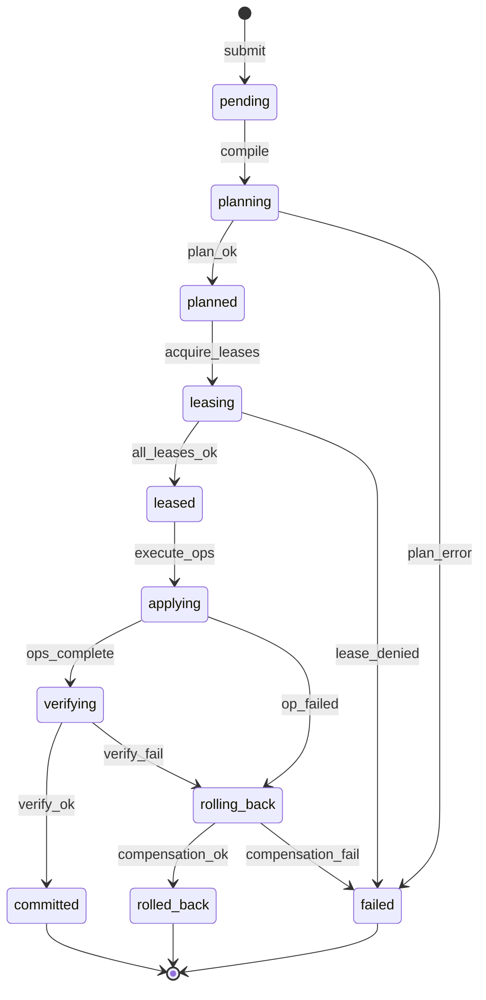

# Transactional Domain Kernel

| Field | Value |
|-------|-------|
| Doc ID | `dcp-core-01` |
| Category | Core Systems |
| Status | draft |
| Version | 0.1.0-draft |
| Depends on | dcp-arch-01, dcp-arch-03 |

---

## Summary

The Transactional Domain Kernel is DCP's **distributed state machine** for domain mutations. It guarantees at-most-once side effects per idempotency key, exclusive access via leases, phased execution with verification, and compensating rollback.

---

## Problem Statement

Domain changes span multiple eventually-consistent systems without native transactions. Partial failure leaves:

- DNS updated but TLS not issued
- Route active but origin unreachable
- Email SPF changed without DKIM overlap
- Registrar lock removed mid-transfer

The kernel provides **logical atomicity** with explicit failure surfaces.

---

## Transaction Phases



---

## Core Invariants

| ID | Invariant |
|----|-----------|
| K1 | No `apply` without approved `plan_hash` |
| K2 | No two transactions hold overlapping leases on same resource |
| K3 | `commit` implies provenance record written |
| K4 | `rollback` uses only pre-declared compensations |
| K5 | Idempotency key + org_id uniquely identifies transaction outcome |
| K6 | Route runtime push may succeed while DNS still `propagating` — statuses are independent |

---

## Lease Model

```json
{
  "lease_id": "lease_a91",
  "resource": "fqdn:api.example.com",
  "holder": "txn_7b2",
  "ttl_ms": 120000,
  "mode": "exclusive"
}
```

| Resource granularity | Examples |
|---------------------|----------|
| Zone | `zone:example.com` |
| FQDN | `fqdn:api.example.com` |
| Record set | `rrset:example.com:TXT` |
| Registrar lock | `registrar:example.com:lock` |

Lease acquisition order: **global total order** on resource keys prevents deadlock.

---

## Idempotency

```
POST /v1/transactions
Idempotency-Key: deploy-api-v3-20260628
```

| Replay scenario | Behavior |
|-----------------|----------|
| Same key, in-flight | Return 409 + `transaction_id` |
| Same key, committed | Return 200 + original result |
| Same key, failed | Return original error (optional retry flag) |

Stored: request hash, response body, terminal state.

---

## Apply Engine

Operations execute via Recipe Runtime with:

- Per-op timeout and circuit breaker
- Snapshot before mutating op (`snap_op_N`)
- Partial completion tracking
- Parallel execution of independent ops (DAG scheduler)

**Saga pattern:** No 2PC across registrars and DNS. Compensations are best-effort with human escalation path on `compensation_fail`.

---

## Verify Phase

| Check | Pass criteria |
|-------|---------------|
| Authoritative DNS | Record matches plan at NS |
| Propagation sample | ≥ configured percentile |
| TLS handshake | Cert valid, correct SAN, chain trusted |
| HTTP probe | Expected status from route runtime |
| Email DNS | SPF/DKIM/DMARC resolvable |
| Provider verification | Token visible (if in scope) |

Verify failures trigger automatic rollback if `auto_rollback: true` (default for routing-critical).

---

## Commit Semantics

On commit:

1. Intent version pointer advances (`int_v12` → `int_v13`)
2. Provenance edge appended
3. Webhooks fire (`transaction.committed`)
4. Observability SLA timers start (propagation tracking)

**Not on commit:** Claim of global DNS convergence.

---

## API Surface

See [dcp-02-transaction-api.md](../04-apis/dcp-02-transaction-api.md).

| Endpoint | Purpose |
|----------|---------|
| `POST /transactions` | Submit new transaction |
| `GET /transactions/{id}` | Status + phase |
| `POST /transactions/{id}/rollback` | Compensating transaction |
| `GET /transactions/{id}/events` | Event stream |

---

## Failure Modes

| Failure | Recovery |
|---------|----------|
| Provider 503 mid-apply | Retry with backoff; lease extended |
| Lease TTL expiry | Transaction → `failed`; ops may complete orphan — immune system detects drift |
| Split brain (rare) | Fencing token on provider writes |
| Compensation partial | `failed` + break-glass alert |

---

## Observability

Events (CloudEvents format):

- `dcp.transaction.phase_changed`
- `dcp.transaction.op_completed`
- `dcp.transaction.lease_acquired`
- `dcp.transaction.committed`
- `dcp.transaction.rolled_back`