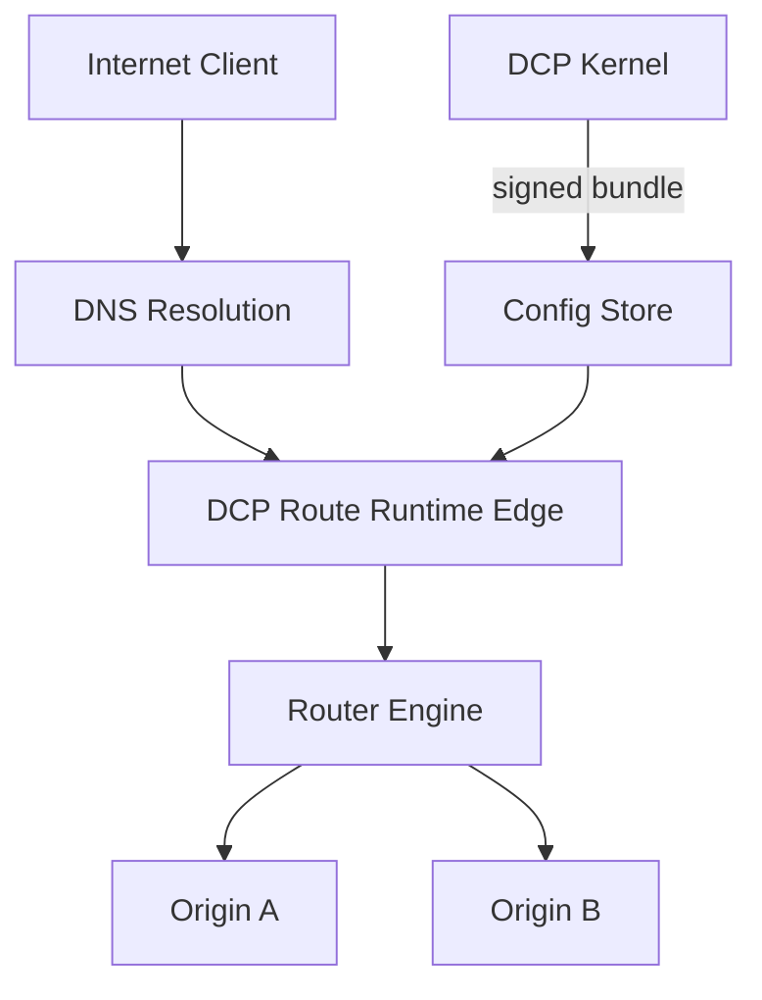

# Hosted and Self-Hosted Route Runtime

| Field | Value |
|-------|-------|
| Doc ID | `dcp-core-03` |
| Category | Core Systems |
| Status | draft |
| Version | 0.1.0-draft |
| Depends on | dcp-arch-01, dcp-core-01 |

---

## Summary

The Route Runtime is DCP's **data plane for instant routing**. Once DNS points to a stable runtime endpoint, path, origin, weight, and TLS presentation change in milliseconds for new requests — decoupled from DNS propagation.

---

## Problem Statement

DNS TTLs turn every routing change into a distributed cache invalidation problem. CDNs solve this for their customers but not as a **domain-native, provider-neutral** primitive with versioned rollback.

---

## Architecture



---

## Route Config Bundle

```json
{
  "bundle_version": 42,
  "domain": "api.example.com",
  "effective_at": "2026-06-28T12:00:00Z",
  "routes": [
    {
      "match": { "path_prefix": "/v2" },
      "backend": { "url": "https://v2.internal", "weight": 100 }
    },
    {
      "match": { "path_prefix": "/" },
      "backend": { "url": "https://v1.internal", "weight": 100 }
    }
  ],
  "tls": {
    "cert_id": "cert_abc",
    "min_version": "1.2",
    "hsts": { "max_age": 31536000, "include_subdomains": true }
  },
  "headers": {
    "request_set": { "X-DCP-Route-Version": "42" }
  },
  "signature": "ed25519:..."
}
```

Bundles are **immutable**; new version = new bundle. Rollback = activate previous bundle pointer.

---

## Hosted Runtime

| Property | Value |
|----------|-------|
| Entry | Anycast IPv4/IPv6 or `*.proxy.dcp.dev` |
| TLS | Terminated at edge; auto cert from DCP CA integration |
| Protocols | HTTP/1.1, HTTP/2, HTTP/3 (QUIC) |
| Features | Path routing, weighted split, header rewrite, redirect |

**Stable DNS pattern:**

```
api.example.com  CNAME  tenant-abc.edge.dcp.dev  TTL 3600
```

After initial setup, **zero DNS changes** for origin migrations.

---

## Self-Hosted Runtime

Delivered as:

- Kubernetes operator + gateway (Envoy/NGINX)
- Single-binary edge agent
- WASM plugin for existing CDN (where supported)

Registration:

```bash
dcp runtime register \
  --name prod-edge-eu \
  --endpoint https://runtime.internal:8443 \
  --mtls-cert ./agent.crt
```

Kernel pushes bundles via:

1. Pull model (runtime polls)
2. Push model (gRPC stream)
3. Object storage watch (S3 signed URL)

**Offline tolerance:** Runtime caches last 5 bundles; refuses unsigned updates.

---

## Traffic Management

| Feature | DNS required? | Effective |
|---------|---------------|-----------|
| Blue/green origin switch | No | Immediate |
| Canary 5% → 50% | No | Immediate |
| Geographic steering | Optional | Immediate at edge |
| Apex domain onboarding | Yes (once) | After propagation |
| Wildcard `*.staging` | Once if pre-provisioned | Immediate per host |

---

## Health Checks

Runtime performs active probes on backends:

```yaml
health_check:
  interval_ms: 5000
  path: /health
  healthy_threshold: 2
  unhealthy_threshold: 3
```

Unhealthy origins removed from pool; kernel receives `runtime.backend_unhealthy` events.

---

## Observability

Per-route metrics:

- `dcp_runtime_requests_total{host, path, backend}`
- `dcp_runtime_latency_ms_histogram`
- `dcp_runtime_tls_handshake_errors`
- `dcp_runtime_bundle_version_active`

Request tracing: `X-DCP-Transaction-Id` header links to provenance.

---

## Security

| Control | Implementation |
|---------|----------------|
| Origin allowlist | Only declared backends connectable |
| mTLS to origin | Optional per route |
| WAF integration | Policy hook at edge |
| DDoS | Platform-level (hosted) or customer (self-hosted) |

---

## Failure Modes

| Scenario | Behavior |
|----------|----------|
| Control plane down | Serve last bundle indefinitely |
| Bad bundle signature | Reject; keep current |
| All backends unhealthy | 503 + alert |
| Cert expired | Block TLS handshake; kernel auto-renew transaction |