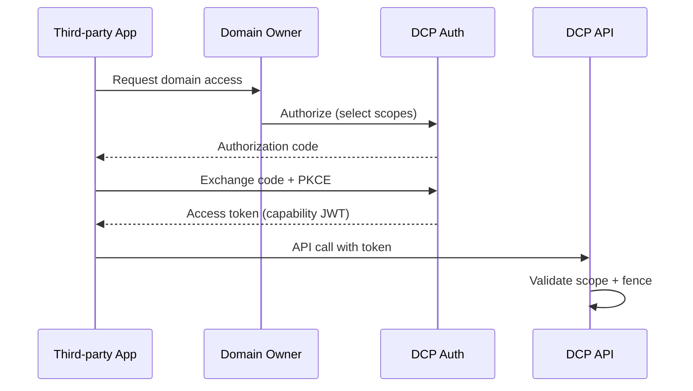

# Domain OAuth and Scoped Capability Tokens

| Field | Value |
|-------|-------|
| Doc ID | `dcp-core-04` |
| Category | Core Systems |
| Status | draft |
| Version | 0.1.0-draft |
| Depends on | dcp-arch-02, dcp-core-06 |

---

## Summary

Domain OAuth extends OAuth 2.0 with **FQDN-scoped capabilities** so applications, CI jobs, and AI agents mutate only what they need — never full registrar admin.

---

## Threat Addressed

| Current practice | Risk |
|------------------|------|
| Registrar API key in CI | Full domain takeover if leaked |
| Shared Cloudflare token | Blast radius = entire account |
| Human dashboard access for bots | No audit granularity |

---

## OAuth Flow (Authorization Code + PKCE)



---

## Capability Token Structure (JWT)

```json
{
  "iss": "https://auth.dcp.dev",
  "sub": "app_client_882",
  "aud": "https://api.dcp.dev",
  "exp": 1719590400,
  "dcp": {
    "org_id": "org_abc",
    "actor_type": "application",
    "capabilities": [
      {
        "action": "route:write",
        "resource": "fqdn:api.example.com",
        "environment": "staging"
      },
      {
        "action": "dns:write",
        "resource": "rrset:*.staging.example.com:TXT",
        "constraints": { "max_ttl": 300 }
      }
    ],
    "deny": [
      { "action": "*", "resource": "fqdn:example.com" }
    ],
    "token_id": "cap_991",
    "parent_grant": "grant_user_44"
  }
}
```

---

## Capability Grammar

```
action   ::= facet:verb
facet    ::= route | dns | tls | email | verify | txn | intent
verb     ::= read | write | admin
resource ::= fqdn:PATTERN | zone:NAME | rrset:NAME:TYPE | registrar:NAME
```

Examples:

| Scope | Meaning |
|-------|---------|
| `route:write:fqdn:api.example.com` | Change routing for one host |
| `dns:write:rrset:_acme-challenge.*:TXT` | ACME only |
| `intent:read:zone:example.com` | Read intent, no mutate |
| `txn:submit:environment:staging` | Transactions in staging only |

---

## Scope Presets (UX)

| Preset | Capabilities | Use case |
|--------|--------------|----------|
| `deploy-bot` | `route:write` on `*.staging` | CI deploy |
| `email-setup` | `email:write`, `dns:write:TXT` on apex | Mail onboarding |
| `verify-only` | `verify:write` | SaaS domain verification |
| `read-only-audit` | `*:read` on zone | Security scanners |

---

## Token Lifecycle

| Event | Action |
|-------|--------|
| Issue | Provenance node `grant` |
| Use | Audit log per API call |
| Refresh | Rotating refresh token; capabilities may shrink, never expand without re-consent |
| Revoke | Instant; propagates to API validators < 5s |
| Expire | Hard stop; no grace for `write` |

---

## Agent-Specific Constraints

AI agents receive **narrower** defaults:

- Max TTL 60s on tokens
- No `registrar:*` scopes
- `txn:submit` requires `human_approved_plan_hash` claim for production
- Rate limits 10x stricter

---

## Break-Glass

Emergency capability:

```json
{
  "action": "*:admin",
  "resource": "zone:example.com",
  "constraints": {
    "max_duration_s": 86400,
    "require_mfa": true,
    "require_ticket": true
  }
}
```

Auto-revoke + mandatory post-incident review.

---

## API

See [dcp-06-auth-api.md](../04-apis/dcp-06-auth-api.md).

---

## Federation (Enterprise)

Self-hosted DCP may trust external IdP (Okta, Entra) and issue DCP capability tokens via token exchange (RFC 8693).