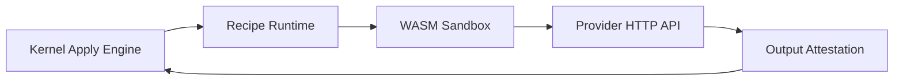

# Signed Provider Recipe Runtime

| Field | Value |
|-------|-------|
| Doc ID | `dcp-core-05` |
| Category | Core Systems |
| Status | draft |
| Version | 0.1.0-draft |
| Depends on | dcp-core-01, dcp-core-02 |

---

## Summary

Provider heterogeneity is isolated in **signed, sandboxed recipes** executed by the Recipe Runtime. The kernel never embeds provider SDKs — only invokes attested adapters.

---

## Recipe Bundle Format

```yaml
apiVersion: dcp.dev/v1
kind: ProviderRecipe
metadata:
  name: cloudflare
  version: 2.4.1
  publisher: dcp-official
  signature: cosign:sha256:...
spec:
  capabilities: [dns.read, dns.write, route.write]
  credential_schema:
    type: api_token
    scopes: [Zone:Read, Zone:DNS:Edit]
  operations:
    dns.upsert:
      wasm_module: cloudflare_dns_upsert.wasm
      timeout_ms: 30000
    http_route.apply:
      wasm_module: cloudflare_route_apply.wasm
  attestations:
    outputs: [record_id, etag]
```

---

## Execution Model



| Property | Detail |
|----------|--------|
| Sandbox | WASM with no network except allowlisted provider endpoints |
| Credentials | Injected at runtime; never in recipe binary |
| Memory | 64MB default cap |
| CPU | 5s wall clock default |

---

## Recipe Signing

| Signer | Trust level |
|--------|-------------|
| `dcp-official` | Bundled with platform |
| `verified-partner` | Vendor-maintained |
| `community` | Opt-in per org; policy warning |
| `customer` | Self-hosted enterprise |

Kernel rejects:

- Expired signatures
- Revoked publisher keys
- Capability claims exceeding publisher tier

---

## Operation Contract

Input:

```json
{
  "operation": "dns.upsert",
  "params": { "zone_id": "abc", "type": "CNAME", "name": "api", "content": "..." },
  "snapshot_ref": "snap_op_16",
  "credential_ref": "cred_cf_token",
  "fencing_token": 7712
}
```

Output:

```json
{
  "status": "success",
  "attestation": {
    "provider_request_id": "cf_req_99",
    "etag": "W/\"abc\"",
    "observed_state_hash": "sha256:..."
  },
  "compensation_data": { "previous_record": {} }
}
```

---

## Recipe Registry

| Channel | Update cadence |
|---------|------------------|
| Stable | Monthly |
| Latest | Weekly |
| Pinned | Customer-controlled |

Org policy example:

```yaml
recipe_policy:
  allowed_publishers: [dcp-official, cloudflare-inc]
  max_version_lag: 1 minor
  require_attestation: true
```

---

## Drift Detection

Recipes return `observed_state_hash` post-mutation. Immune system compares to intent IR on schedule.

---

## Adding a Provider (Recipe Author Guide)

1. Implement read operations (`zone.list`, `dns.list`)
2. Implement write operations with compensation data
3. Submit conformance test suite (golden files)
4. Sign bundle; publish to registry
5. DCP review for capability claims

**No kernel code changes required.**

---

## Failure Modes

| Failure | Kernel behavior |
|---------|-----------------|
| WASM trap | Op failed → rollback |
| Provider 429 | Retry with recipe-defined backoff |
| Attestation mismatch | Op failed → quarantine + alert |
| Unsigned recipe | Reject at load time |