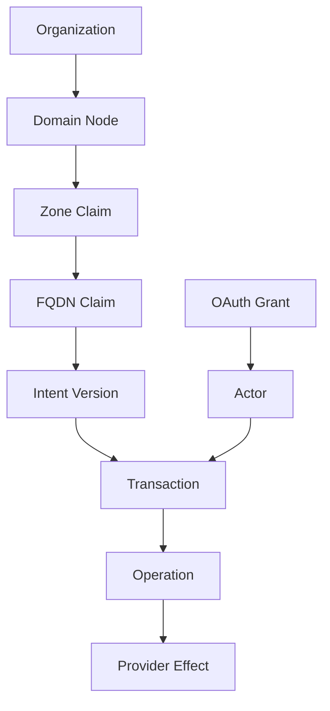

# Ownership and Provenance Graph

| Field | Value |
|-------|-------|
| Doc ID | `dcp-core-06` |
| Category | Core Systems |
| Status | draft |
| Version | 0.1.0-draft |
| Depends on | dcp-core-01, dcp-core-04 |

---

## Summary

The Ownership and Provenance Graph is DCP's **authoritative lineage model**: who may control which domain resources, how intent versions relate, and what transactions caused each effective state.

---

## Graph Schema



### Node Types

| Node | Key attributes |
|------|----------------|
| `Organization` | `org_id`, billing, policy_pack |
| `Domain` | `domain`, registrar_link |
| `ZoneClaim` | `zone`, `claimant_org`, `evidence` |
| `FQDNClaim` | `fqdn`, `claimant`, `parent_zone` |
| `IntentVersion` | `version_id`, `content_hash`, `parent` |
| `Transaction` | `txn_id`, `phase`, `plan_hash` |
| `Actor` | `user`, `app`, `agent`, `system` |
| `Effect` | `provider`, `resource`, `state_hash` |

### Edge Types

| Edge | Meaning |
|------|---------|
| `OWNS` | Legal/operational control |
| `DELEGATES` | Subdomain delegated to tenant |
| `DERIVED_FROM` | Intent version lineage |
| `CAUSED_BY` | Effect from transaction |
| `AUTHORIZED_BY` | Actor via grant |
| `FENCES` | Mutual exclusion constraint |

---

## Domain Claim Evidence

To claim `example.com`:

| Evidence type | Strength |
|---------------|----------|
| Registrar OAuth link | Strong |
| DNS TXT `_dcp-challenge` | Strong |
| NS delegation to DCP adapter | Strong |
| Manual enterprise attestation | Policy-based |

Claims without evidence → `pending` (read-only probes allowed).

---

## Multi-Tenant SaaS Pattern

```
example.com (platform org)
  └── DELEGATES tenant-882.api.example.com → Tenant Org 882
  └── DELEGATES *.customers.example.com → wildcard tenant pool
```

Fence: tenant A cannot compile ops touching tenant B's FQDN.

---

## Provenance Record (Per Commit)

```json
{
  "provenance_id": "prov_f44",
  "intent_version": "int_v13",
  "transaction_id": "txn_7b2",
  "plan_hash": "sha256:...",
  "actor": {
    "type": "application",
    "id": "app_ci_deploy",
    "grant_id": "grant_22"
  },
  "parent_provenance": "prov_e19",
  "timestamp": "2026-06-28T12:00:00Z",
  "effects": [
    { "fqdn": "api.example.com", "kind": "route", "bundle_version": 42 }
  ],
  "signature": "ed25519:..."
}
```

Records are **hash-chained** for tamper evidence.

---

## Fence Rules

| Fence | Prevents |
|-------|----------|
| Single apex owner | Two orgs claiming `example.com` |
| Subdomain exclusivity | Overlapping wildcard delegates |
| Production lock | Staging tokens writing production |
| Registrar split | DNS control without claim evidence |

Violations → `COMPILE_CONFLICT` at fence check pass.

---

## Queries

| Query | API |
|-------|-----|
| Who owns `api.example.com`? | `GET /provenance/claims?fqdn=` |
| Why does this TXT exist? | `GET /provenance/effects?rrset=` |
| History of intent | `GET /intent/versions?domain=` |
| Blast radius of actor | `GET /provenance/actors/{id}/graph` |

---

## Drift vs Intent

Immune system opens `DriftNode` when observed state ≠ intent:

```json
{
  "drift_id": "drift_09",
  "detected_at": "...",
  "expected_hash": "sha256:a",
  "observed_hash": "sha256:b",
  "suggested_transaction": "txn_reconcile_auto"
}
```

---

## Compliance Export

Provenance graph exports to:

- SIEM (JSON Lines)
- eDiscovery (GraphML)
- SOC2 evidence bundles (signed archive)