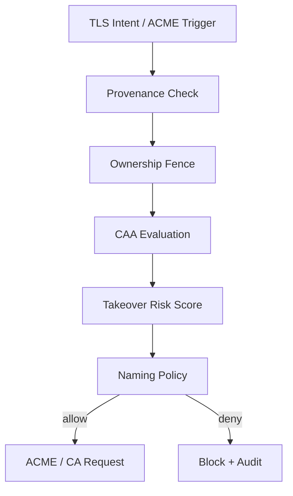

# Certificate Firewall

| Field | Value |
|-------|-------|
| Doc ID | `dcp-core-07` |
| Category | Core Systems |
| Status | draft |
| Version | 0.1.0-draft |
| Depends on | dcp-core-06, dcp-core-08 |

---

## Summary

The Certificate Firewall is a **default-deny gate** between TLS intent and Certificate Authorities. No certificate is requested until provenance, CAA, takeover risk, and naming policy pass.

---

## Threat Model Addressed

| Threat | Without firewall |
|--------|------------------|
| Mis-issued cert for dangling subdomain | Attacker hosts origin, passes HTTP-01 |
| Insider issues cert for competitor domain | Stolen API token |
| CA misconfiguration | Wildcard where not intended |
| Expired CAA | Issuance despite deny policy |

---

## Decision Pipeline



---

## Checks

### 1. Provenance Check

- FQDN has active `FQDNClaim`
- Requesting actor has `tls:issue` capability
- Intent version explicitly declares `tls.mode: auto` or custom cert

### 2. CAA Evaluation

```
example.com CAA 0 issue "letsencrypt.org"
api.example.com CAA 0 issuewild ";"
```

Compiler ensures CAA records align before ACME. Firewall re-checks live DNS.

### 3. Takeover Risk Score

| Signal | Weight |
|--------|--------|
| Dangling CNAME target | Critical deny |
| NXDOMAIN on origin probe | High deny |
| Recent orphan cloud resource | High deny |
| New FQDN < 24h without route | Medium review |

Score > threshold → deny + immune system ticket.

### 4. Naming Policy

```yaml
cert_policy:
  allow_wildcard: false
  max_sans: 10
  forbidden_patterns: ["*.*.example.com"]
  require_org_validation: true
```

---

## Firewall Modes

| Mode | Behavior |
|------|----------|
| `strict` (default) | Deny on any warning |
| `enterprise` | Deny critical; queue medium for approval |
| `audit` | Allow but alert (migration only) |

---

## ACME Integration

DCP operates ACME client as privileged subsystem:

1. Firewall `ALLOW` with `decision_id`
2. Compiler emits challenge records (transaction)
3. ACME order created with `decision_id` metadata
4. On success, cert stored in vault; runtime bundle updated
5. Provenance effect recorded

**Firewall decision is immutable input to ACME** — cannot be bypassed by direct ACME API.

---

## Custom Certificates

`tls.mode: custom` uploads require:

- Cert chain validation
- Private key in HSM/vault only
- Matching provenance claim
- Expiry monitoring transaction scheduled

---

## Observability

| Event | Payload |
|-------|---------|
| `cert_firewall.allowed` | `decision_id`, `fqdn`, `actor` |
| `cert_firewall.denied` | `reason_code`, `risk_score` |
| `cert.issued` | `cert_id`, `sans`, `ca` |
| `cert.renewal_scheduled` | `expires_at` |

---

## Failure Modes

| Scenario | Behavior |
|----------|----------|
| CAA propagation lag | Delay ACME until probe pass |
| False positive deny | Human override with break-glass + ticket |
| CA outage | Queue renewal; runtime uses existing cert until expiry buffer |