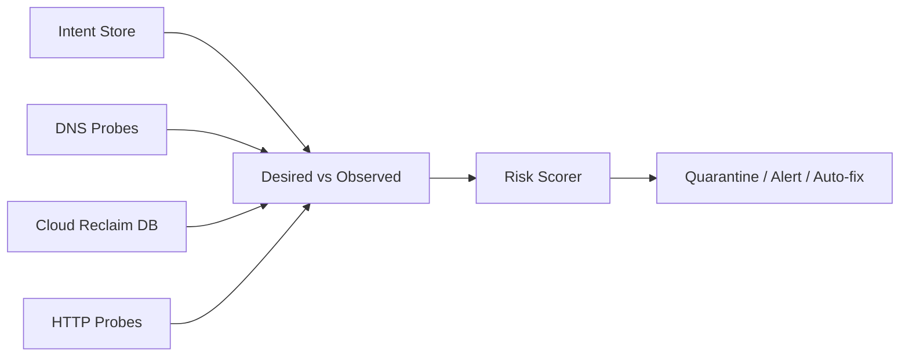

# Subdomain Takeover Immune System

| Field | Value |
|-------|-------|
| Doc ID | `dcp-core-08` |
| Category | Core Systems |
| Status | draft |
| Version | 0.1.0-draft |
| Depends on | dcp-core-06, dcp-core-07 |

---

## Summary

The Takeover Immune System continuously detects **dangling DNS**, **reclaimable cloud resources**, and **orphan routes** — quarantining risk before attackers exploit it.

---

## Attack Vectors Covered

| Vector | Example |
|--------|---------|
| Dangling CNAME | `legacy.example.com → deleted.azurewebsites.net` |
| Dangling NS | Subzone NS to deprovisioned DNS host |
| Stale A/AAAA | IP reassigned to attacker VM |
| Forgotten verification TXT | Proves control to third party |
| Abandoned SaaS custom domain | GitHub Pages, Heroku, S3 website |
| NXDOMAIN origin behind proxy | Route points to dead backend |

---

## Detection Pipeline



Runs every 60s (hosted) or configurable (self-hosted).

---

## Risk Scoring

```json
{
  "fqdn": "staging.api.example.com",
  "risk_score": 92,
  "severity": "critical",
  "signals": [
    {
      "code": "DANGLING_CNAME",
      "detail": "target saas-app.herokuapp.com NXDOMAIN",
      "reclaimable": true
    }
  ],
  "recommended_action": "quarantine_and_notify"
}
```

| Score | Action |
|-------|--------|
| 0–30 | Log only |
| 31–60 | Warning + dashboard |
| 61–85 | Block new TLS issuance (cert firewall link) |
| 86–100 | Quarantine route + optional auto-remove record |

---

## Quarantine Semantics

Quarantined FQDN:

- Route runtime returns 421 / connection reset
- New transactions touching FQDN require `takeover:override` capability
- Certificate firewall denies issuance
- Provenance `QuarantineNode` appended

---

## Cloud Reclaim Database

DCP maintains (and accepts feeds for) known reclaimable suffixes:

```
*.azurewebsites.net
*.herokuapp.com
*.s3-website.amazonaws.com
*.github.io
*.cloudfront.net (distribution deleted)
...
```

Research experiment: community-signed reclaim rules — see [dcp-03-research-experiments.md](../07-roadmap/dcp-03-research-experiments.md).

---

## Auto-Remediation

Policy-gated transactions:

```yaml
takeover_policy:
  auto_remove_dangling_cname: true
  auto_notify_owner: true
  create_incident: severity >= high
```

Auto-fix creates provenance-linked `txn_remediate_*` — never silent.

---

## Integration with Certificate Firewall

Shared risk score. Critical dangling → dual block (route + cert).

---

## Customer-Facing API

```
GET  /v1/domains/{domain}/takeover-risks
POST /v1/domains/{domain}/takeover-scan
POST /v1/fqdn/{fqdn}/quarantine
DELETE /v1/fqdn/{fqdn}/quarantine  # requires override capability
```

---

## Honest Limits

| Limit | Detail |
|-------|--------|
| Cannot detect all cloud APIs | Reclaim DB incomplete without customer cloud linking |
| Internal DNS blind spots | Self-hosted needs internal probe agents |
| Zero-day SaaS patterns | Community feed latency |
| Historical CT logs | Attacker may have cert before quarantine — monitor CT |