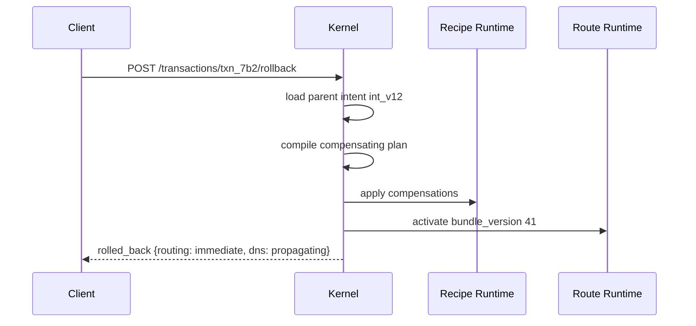

# Domain Tests, Replay, Simulation, and Rollback

| Field | Value |
|-------|-------|
| Doc ID | `dcp-core-09` |
| Category | Core Systems |
| Status | draft |
| Version | 0.1.0-draft |
| Depends on | dcp-core-01, dcp-core-02 |

---

## Summary

DCP treats domains as **testable infrastructure**: intent has assertions, changes run in simulation, production transactions replay in sandboxes, and rollback is a first-class compensating transaction.

---

## Domain Tests

### Intent Assertions

```yaml
tests:
  - name: api-route-healthy
    host: api.example.com
    assert:
      dns:
        cname_ends_with: edge.dcp.dev
      tls:
        min_version: "1.2"
        san_contains: api.example.com
      http:
        url: https://api.example.com/health
        status: 200
        within_ms: 500
      email:
        spf_includes: ["_spf.google.com"]
        dmarc_policy: quarantine
```

Tests compile to probe schedules + CI-checkable predicates.

### Test Execution Modes

| Mode | When |
|------|------|
| `continuous` | Every 5 min in production |
| `pre-commit` | `dcp test --intent ./domain.intent.yaml` |
| `pre-transaction` | Gate before apply phase |
| `post-commit` | Verify phase superset |

---

## Simulation

Simulation runs the full **compile → policy → plan** pipeline without leases or provider writes.

```bash
dcp simulate --intent ./intent.yaml --from int_v12
```

### Synthetic Models

| Model | Purpose |
|-------|---------|
| Resolver model | Estimate propagation percentile vs TTL |
| Provider latency model | Predict transaction duration |
| Failure injection | Random 503 on op 3 |
| Takeover model | Score risk delta |

Output:

```json
{
  "simulation_id": "sim_44a",
  "plan_hash": "sha256:...",
  "predicted_routing_active_ms": 1200,
  "predicted_dns_p50_minutes": 8,
  "policy_decisions": [],
  "risks_introduced": [],
  "test_results_predicted": { "passed": 12, "failed": 0 }
}
```

---

## Replay

Replay re-executes historical transaction against:

| Target | Use |
|--------|-----|
| Shadow providers | Debug provider recipe bugs |
| Staging environment | Validate promotion |
| Local simulator | Offline forensics |

```bash
dcp replay --transaction txn_7b2 --target shadow
```

Replay produces `replay_diff`:

```json
{
  "original_plan_hash": "sha256:a",
  "replayed_plan_hash": "sha256:a",
  "op_results_match": true,
  "provider_response_diffs": []
}
```

**Replay never mutates production** unless `--target production` with break-glass.

---

## Rollback

Rollback is **not** undo in the physics sense — it is a **compensating transaction** restoring prior intent version.



### Rollback Types

| Type | Scope |
|------|-------|
| `transaction` | Undo single txn effects |
| `intent_version` | Restore `int_vN` |
| `partial` | Single FQDN or facet |
| `emergency` | Break-glass full zone revert |

### Rollback Limits

| Cannot instantly undo | Mitigation |
|-----------------------|------------|
| Global DNS caches | Set correct authoritative; monitor |
| CT log entries | Cert revocation + short-lived certs |
| Email receiver cache | Dual-record overlap period |
| Registrar transfer | Out of scope if transfer committed |

---

## CI/CD Integration

```yaml
# .github/workflows/domain.yml
jobs:
  domain-gate:
    steps:
      - run: dcp compile --diff origin/main --fail-on-change
      - run: dcp simulate --output sim.json
      - run: dcp test --assert sim.json
      - run: dcp transactions submit --wait --idempotency-key ${{ github.sha }}
```

---

## Observability

| Metric | Description |
|--------|-------------|
| `dcp_tests_passing_ratio` | Per domain |
| `dcp_simulation_runs_total` | CI vs manual |
| `dcp_rollback_success_rate` | By provider |
| `dcp_replay_drift_detected` | Recipe regression signal |