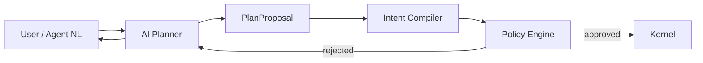

# AI Planner and Debugger

| Field | Value |
|-------|-------|
| Doc ID | `dcp-core-10` |
| Category | Core Systems |
| Status | draft |
| Version | 0.1.0-draft |
| Depends on | dcp-core-02, dcp-vision-03 |

---

## Summary

The AI Planner translates natural language and incident context into **PlanProposals**. It never bypasses the deterministic compiler or policy engine. It accelerates human decisions; it does not replace them.

---

## Architectural Boundary



**Forbidden paths (enforced in API):**

- AI → Kernel direct apply
- AI → Recipe Runtime
- AI → Certificate Firewall override
- AI → Provenance mutation

---

## PlanProposal Schema

```json
{
  "kind": "PlanProposal",
  "proposal_id": "prop_88c",
  "natural_language_request": "Point staging.api.example.com to the new k8s ingress",
  "proposed_intent_delta": {
    "routes": [
      {
        "host": "staging.api.example.com",
        "traffic": { "origin": "https://ingress-new.internal" }
      }
    ]
  },
  "confidence": 0.91,
  "reasoning_summary": "Matches existing staging pattern; no DNS change needed.",
  "required_capabilities": ["route:write:fqdn:staging.api.example.com"],
  "compile_preview": null
}
```

Client or system calls:

```
POST /v1/compile { intent_delta: proposal.proposed_intent_delta }
```

Compiler fills `compile_preview` with `plan_hash`, errors, policy hints.

---

## Debugger Mode

Given failed transaction or probe:

**Input:** `transaction_id`, logs, probe results, intent diff

**Output:**

```json
{
  "kind": "DebugReport",
  "root_cause_hypothesis": "CAA record blocks letsencrypt.org",
  "evidence": ["probe:caa_lookup", "txn:op_3_failed"],
  "suggested_fixes": [
    {
      "description": "Add CAA issue letsencrypt.org",
      "intent_delta": { "tls": { "caa": ["issue letsencrypt.org"] } },
      "proposal_id": "prop_fix_1"
    }
  ],
  "cannot_auto_fix": ["Registrar lock enabled — human must disable"]
}
```

Each fix is a PlanProposal — human or CI must submit transaction.

---

## Training Data Boundaries

| Allowed context | Forbidden context |
|-----------------|-------------------|
| Customer's intent versions | Other customers' data |
| Public DNS lookups | Raw registrar credentials |
| DCP docs + recipe schemas | Provider API keys |
| Anonymized failure patterns | PII in WHOIS |

---

## Production Safety Rails

| Rail | Implementation |
|------|----------------|
| Human-in-loop | Production `txn:submit` requires approval if `confidence < 0.85` |
| Plan hash match | CI must approve exact hash before agent submit |
| Capability ceiling | Agent tokens cannot widen scope via AI |
| Rate limits | 100 proposals/hour per org |
| Audit | Every proposal stored with model version |

---

## Model Routing

| Task | Model tier |
|------|------------|
| Simple route change | Small fast model |
| Multi-facet debug | Large reasoning model |
| Security-sensitive | Rule-based only + retrieval |

Self-hosted: models run locally; no data leaves VPC.

---

## Evaluation Metrics

| Metric | Target |
|--------|--------|
| Proposal compile success | > 90% first attempt |
| Debug root cause accuracy | > 80% (human labeled) |
| Policy bypass attempts | 0 (security test) |
| Mean time to suggested fix | < 30s |

---

## Open Research

- Can simulation outputs fine-tune planner without leaking cross-tenant patterns?
- Formal verification of intent delta against policy (see roadmap)