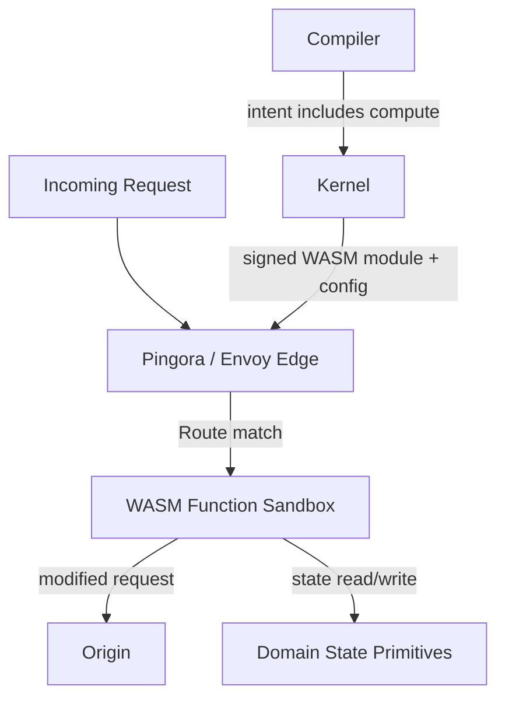

# Programmable Edge (Workers-style Compute)

| Field | Value |
|-------|-------|
| Doc ID | `dcp-core-11` |
| Category | Core Systems |
| Status | draft |
| Version | 0.1.0-draft |
| Depends on | dcp-core-03, dcp-arch-07, dcp-arch-08 |
| Created | 2026-06-28 |

---

## Summary

DCP adds first-class **programmable edge compute** so teams can run small, signed logic (auth, A/B testing, personalization, rate limiting, header transforms, etc.) directly at the edge for any domain or route — inspired by Cloudflare Workers and Vercel Edge Functions, but deeply integrated with DCP's domain-native model, versioning, provenance, and extreme speed goals.

This turns DCP from a smart router into a true **programmable domain platform**.

---

## Goals

- Run lightweight compute with sub-millisecond cold starts where possible.
- Full integration with DCP bundles, version pointers, and rollback.
- Same safety rails as the rest of DCP (policy engine, provenance, human-in-loop for sensitive changes).
- Portable: Works great on Pingora (hosted) and Envoy (self-hosted).

---

## Architecture



**Execution model**:
- WASM modules (wasmtime on Pingora, wazero on Envoy).
- Pre-initialized with Wizer where possible for near-zero cold start.
- Strict resource limits (CPU, memory, time).
- Access only to explicitly allowed Domain State primitives and network allowlists.

---

## Integration with RouteConfigBundle

The `Route` message (see dcp-03-route-runtime) gains a new optional field:

```protobuf
message Route {
  // ... existing fields
  optional WasmModule compute = 6;   // New
}

message WasmModule {
  string module_id = 1;
  string version = 2;
  string hash = 3;
  ResourceLimits limits = 4;
  repeated string allowed_state_keys = 5;
}
```

When a bundle with compute is activated, the edge loads the WASM module and executes it for matching requests.

---

## Use Cases (high value)

- Authentication / JWT validation at edge
- A/B testing & feature flags (tied to Domain State)
- Personalization / geo-steering logic
- Rate limiting & abuse protection (stateful)
- Request/response transformation
- Custom logging or header injection
- Lightweight API gateway logic per domain

---

## Safety & Policy

- All modules must be signed and versioned in DCP.
- Cedar policies can gate which routes are allowed to have compute.
- AI Planner can suggest compute modules but never auto-apply without approval for sensitive operations.
- Full provenance: every execution is linked to the bundle version that deployed it.

---

## Performance Considerations

- Use Wizer pre-init + AOT where possible (already in our WASM recipe pipeline).
- Pool WASM `Store` instances.
- Keep hot path in Rust (Pingora) — only route to WASM when compute is declared.
- State access should go through the Domain State Primitives layer (fast local + durable fallback).

This keeps us on track for <400ms routing activation even with compute enabled.

---

## Related Documents

- [dcp-03-route-runtime.md](./dcp-03-route-runtime.md) — Bundle schema updates
- [dcp-07-extreme-speed-optimizations.md](../02-architecture/dcp-07-extreme-speed-optimizations.md) — Performance targets
- [dcp-12-domain-state-primitives.md](./dcp-12-domain-state-primitives.md) — Stateful compute companion

---

*This brings Cloudflare Workers / Vercel Edge Functions power into DCP's domain-centric world.*