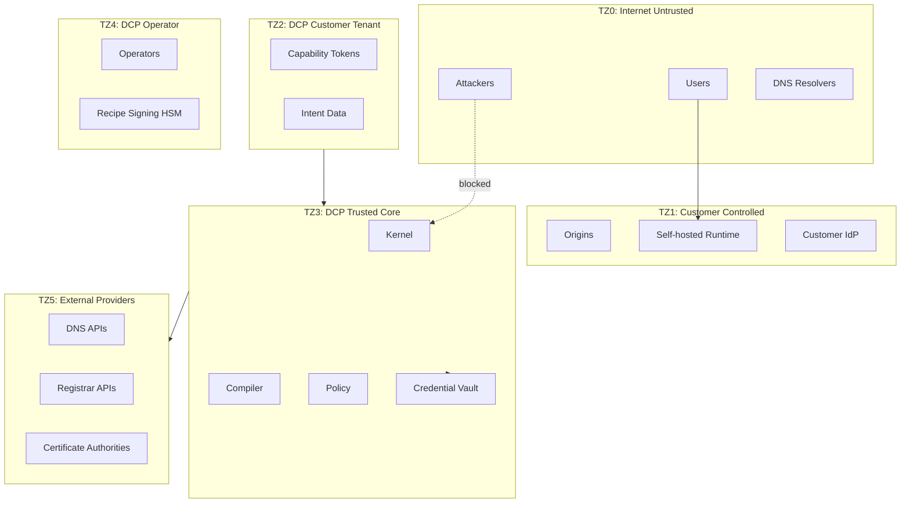

# Trust Boundaries

| Field | Value |
|-------|-------|
| Doc ID | `dcp-sec-02` |
| Category | Security |
| Status | draft |
| Version | 0.1.0-draft |
| Depends on | dcp-sec-01, dcp-arch-02 |

---

## Trust Zones



---

## Boundary Rules

| Crossing | Requirement |
|----------|-------------|
| TZ0 → TZ1 | Standard TLS; customer responsibility |
| TZ1 → TZ3 | mTLS runtime registration; signed bundles |
| TZ2 → TZ3 | Valid capability JWT on every request |
| TZ3 → TZ5 | Recipe sandbox; scoped creds; fencing tokens |
| TZ4 → TZ3 | Break-glass audit; dual control for signing keys |
| AI (TZ2) → Compiler (TZ3) | PlanProposal schema only |

---

## Credential Flow

```
Customer stores registrar token in DCP Vault (TZ3)
  → Never returned via API
  → Injected into Recipe Runtime at op execution
  → Redacted in logs
  → Rotated on schedule / compromise
```

---

## Data Residency

| Data class | Hosted default | Self-hosted |
|------------|----------------|-------------|
| Intent | Region-pinned | Customer DB |
| Provenance | Region-pinned | Customer DB |
| Credentials | Vault HSM | Customer vault integration |
| Probe results | Global aggregation | Optional local-only |
| AI prompts | US region (opt EU) | Local model |

---

## Third-Party Trust

| Party | Trust assumption |
|-------|------------------|
| DNS provider | Correctly applies mutations |
| Registrar | Authoritative for domain status |
| CA | Issues only after valid ACME |
| Recipe publisher | Code matches signed bundle |

DCP verifies via attestation, not blind trust.